# Nitro V 16S Upgrade Price Watch

Daily US prices (USD) for upgrades and GPUs for an Acer Nitro V 16S (ANV16S-71), in five categories, plus high-memory MacBooks for comparison:

| Category | What's tracked |
|---|---|
| `ssd` | 4TB M.2 2280 NVMe PCIe 4.0 SSDs without a heatsink (Lexar NM790, TeamGroup MP44 and T-Force G50, WD Black SN7100 and SN850X, WD Blue SN5000, Samsung 990 EVO Plus and 990 Pro, Crucial T500 and P310, Kingston KC3000, Silicon Power UD90 and other reputable brands), plus the Micron 2500 |
| `ram` | Single 64GB DDR5 SO-DIMM modules, non-ECC, 5600 MT/s or faster |
| `nvidia_gpu` | Desktop RTX 5090, 4090, 3090 Ti and 3090, new and used/refurbished |
| `amd_gpu` | Desktop RX 9070 XT, 9070, 7900 XTX and 7900 XT (plus any newer Radeon above the 9070 XT), new and used/refurbished |
| `egpu` | Thunderbolt/USB4 eGPU enclosures and complete external GPUs |
| `macbook` | MacBook Pro and MacBook Air configurations with 48GB, 64GB, 96GB or 128GB of memory, new and used/refurbished |

Stores: Amazon, eBay, Newegg, Best Buy, Walmart, B&H Photo and Micro Center.

**DEAL flags (🔥):**
- A new 4TB TLC SSD at $450 or less (SSDs only).
- In any category, a price at least 10% below the previous logged price for the same item, store and condition.
- In any category, a price strictly below every earlier price for that item and condition, once there are at least 7 days of history.

## How it works

- A daily routine adds prices to [`prices.csv`](prices.csv) (`date,category,item,spec,store,condition,price_usd,basis,source_date,url`) and writes notes to [`claude.md`](claude.md).
- [`scripts/build_readme.py`](scripts/build_readme.py) rebuilds the dashboard below. GPUs are grouped by model.
- The [Update README dashboard](.github/workflows/update-readme.yml) Action runs the script whenever `prices.csv` or the script changes on `main`. To run it yourself:

```bash
python3 scripts/build_readme.py
```

Only the text between the `PRICES:START` and `PRICES:END` markers is regenerated. Everything above them can be edited by hand.

### GPU price tracker

[`scripts/track_gpus.py`](scripts/track_gpus.py) checks the RTX 5090, 4090, 3090 Ti and 3090 and the RX 9070 XT, 9070, 7900 XTX and 7900 XT on [videocardprices.com](https://videocardprices.com/). It also picks up any newer Radeon card numbered 9080 or higher. It logs in-stock Amazon, Newegg and eBay (used) prices of any age, with the date the source gives. The [Track GPU prices](.github/workflows/track-gpus.yml) Action runs it every day and rebuilds the dashboard.

```bash
python3 scripts/track_gpus.py            # dry run: show what would be logged
python3 scripts/track_gpus.py --write    # append new rows to prices.csv
```

videocardprices.com doesn't cover the RTX 4090, 3090 Ti, 3090 or RX 7900 XT, so the tracker reads those from [gpudeals.net](https://gpudeals.net/) instead. That site shows one Amazon and one eBay price per model, in whole dollars, with no board name or condition; the tracker logs the Amazon price as new and the eBay price as used under the bare model name. Log any other price by hand with [`scripts/add_price.py`](scripts/add_price.py). It applies the same rules:

```bash
python3 scripts/add_price.py nvidia_gpu "RTX 4090 (MSI Gaming X Trio)" "24GB GDDR6X" eBay used 1899.00 "https://www.ebay.com/itm/..."
```

### RAM price tracker

[`scripts/track_ram.py`](scripts/track_ram.py) checks single 64GB DDR5 SO-DIMM modules (1x64GB, 5600 MT/s) on their Amazon product pages: the Crucial CT64G56C46S5 and the G.Skill F5-5600S4645A64GX1-RS. It logs the in-stock price and marks the store as a third-party seller when Amazon isn't the seller. Add a module's Amazon ASIN and part number to `MODULES` in the script to track it.

```bash
python3 scripts/track_ram.py            # dry run: show what would be logged
python3 scripts/track_ram.py --write    # append new rows to prices.csv
```

Run the tests with `python3 -m unittest discover tests`.

## Dashboard

<!-- PRICES:START -->
**Last check:** 2026-11-22 &nbsp;·&nbsp; **Prices logged:** 625 &nbsp;·&nbsp; **Items tracked with prices:** 81 across 6 categories

> 🔥 **DEAL:** MacBook Pro 16 M1 Max 64GB $1,650.00 at Amazon (third-party seller) (all-time low); MacBook Pro 14 M3 Max 64GB $3,999.99 at eBay (all-time low); WD Blue SN5000 $299.95 at eBay (≥10% drop, all-time low); Crucial P310 $425.00 at eBay (≥10% drop, all-time low); Silicon Power UD90 $449.95 at eBay (4TB TLC ≤ $450.00); Samsung 990 Pro $549.00 at eBay (all-time low)

| Category | Latest-check rows | Cheapest new on latest check |
|---|--:|---|
| SSDs | 26 | Crucial P310 — $425.00 (eBay) |
| RAM | 4 | Crucial CT64G56C46S5 — $1,149.99 (eBay) |
| NVIDIA GPUs | 9 | RTX 3090 Ti — $2,150.00 (Amazon) |
| AMD GPUs | 9 | RX 9070 (XFX Swift OC Triple Fan) — $879.99 (Amazon) |
| eGPUs | 0 | — |
| MacBooks | 40 | MacBook Pro 14 M2 Max 96GB — $3,299.74 (eBay) |

### SSDs

> **Cheapest new 4TB TLC SSD on 2026-11-22:** Silicon Power UD90 (4TB TLC (some batches reported QLC)) at **$449.95** (eBay) — [source](https://www.ebay.com/itm/257830211610)

#### Cheapest new 4TB SSD price over time

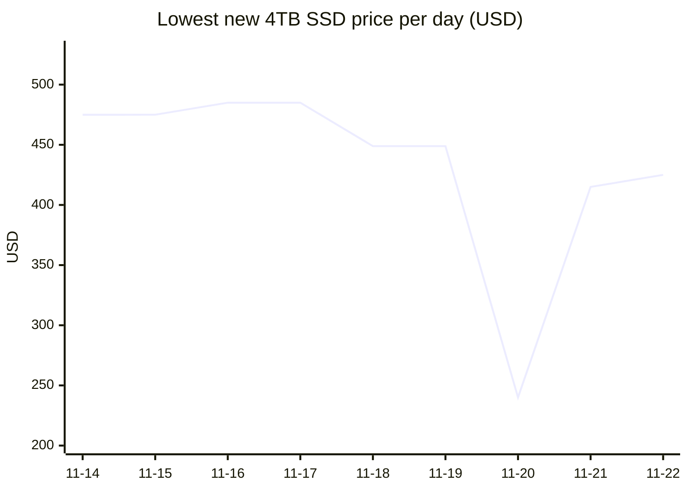
```mermaid
xychart-beta
    title "Lowest new 4TB SSD price per day (USD)"
    x-axis ["11-14", "11-15", "11-16", "11-17", "11-18", "11-19", "11-20", "11-21", "11-22"]
    y-axis "USD" 200 --> 530
    line [474.97, 475.00, 484.99, 484.99, 448.88, 448.88, 239.99, 415.00, 425.00]
```

#### Latest price by item (new, cheapest store)

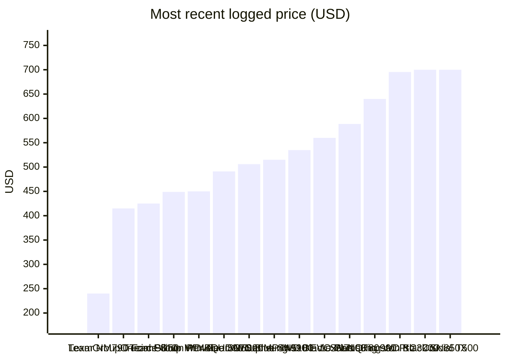
```mermaid
xychart-beta
    title "Most recent logged price (USD)"
    x-axis ["Lexar NM790", "TeamGroup T-Force G50", "Crucial P310", "TeamGroup MP44Q", "Silicon Power UD90", "WD Blue SN5000", "TeamGroup MP44", "WD Blue SN5100", "Samsung 990 EVO Plus", "WD Black SN7100", "Lexar NQ780", "Samsung 990 Pro", "Kingston KC3000", "WD Black SN850X", "Crucial T500"]
    y-axis "USD" 170 --> 770
    bar [239.99, 415.00, 425.00, 448.88, 449.95, 491.00, 505.99, 515.00, 534.86, 559.99, 588.57, 639.99, 695.42, 699.99, 700.00]
```

#### Latest prices

| Item | Spec | Store | Condition | Price | Change | As of | Basis | Link |
|---|---|---|---|--:|--:|---|---|---|
| Lexar NM790 | 4TB TLC | Amazon | new | **$239.99 🔥** | new | 2026-11-20 | reported (WCCFtech) | [link](https://wccftech.com/lexar-nm790-4tb-ssd-is-available-for-239-99-on-amazon/) |
| WD Blue SN5000 | 4TB QLC | eBay | used | **$299.95 🔥** | 🔻 $100.00 | 2026-11-22 | direct | [link](https://www.ebay.com/itm/257864369244) |
| TeamGroup T-Force G50 | 4TB TLC | eBay | used | **$379.99** | — | 2026-11-22 | direct | [link](https://www.ebay.com/itm/117491940156) |
| Silicon Power UD90 | 4TB TLC (some batches reported QLC) | eBay | used | **$399.99** | — | 2026-11-22 | direct | [link](https://www.ebay.com/itm/117329205111) |
| TeamGroup T-Force G50 | 4TB TLC | Newegg | new | **$415.00 🔥** | 🔻 $80.99 | 2026-11-21 | reported (Wccftech) | [link](https://www.newegg.com/team-group-4tb-t-force-g50-nvme-1-4/p/N82E16820985283) |
| Crucial P310 | 4TB QLC | eBay | new | **$425.00 🔥** | 🔻 $75.00 | 2026-11-22 | direct | [link](https://www.ebay.com/itm/407369790835) |
| Lexar NM790 | 4TB TLC | eBay | used | **$429.99** | — | 2026-11-22 | direct | [link](https://www.ebay.com/itm/198812393890) |
| TeamGroup MP44Q | 4TB QLC | eBay | new | **$448.88** | — | 2026-11-22 | direct | [link](https://www.ebay.com/itm/137741171807) |
| Silicon Power UD90 | 4TB TLC (some batches reported QLC) | eBay | new | **$449.95 🔥** | — | 2026-11-22 | direct | [link](https://www.ebay.com/itm/257830211610) |
| Samsung 990 EVO Plus | 4TB TLC | eBay | used | **$449.99** | — | 2026-11-22 | direct | [link](https://www.ebay.com/itm/257862471516) |
| TeamGroup T-Force G50 | 4TB TLC | eBay | new | **$469.95** | — | 2026-11-22 | direct | [link](https://www.ebay.com/itm/307262872935) |
| Crucial P310 | 4TB QLC | eBay | used | **$470.00** | — | 2026-11-22 | direct | [link](https://www.ebay.com/itm/117529942006) |
| Silicon Power UD90 | 4TB TLC (some batches reported QLC) | Amazon (third-party seller) | new | **$474.97** | 🔻 $48.03 | 2026-11-19 | direct | [link](https://www.amazon.com/dp/B0BYN8NHXS) |
| Silicon Power UD90 | 4TB TLC (some batches reported QLC) | Newegg | new | **$475.00** | — | 2026-11-15 | reported (PC Gamer) | [link](https://www.pcgamer.com/black-friday-ssd-deals/) |
| WD Black SN7100 | 4TB TLC | eBay | used | **$480.00** | — | 2026-11-22 | direct | [link](https://www.ebay.com/itm/137884465960) |
| TeamGroup MP44Q | 4TB QLC | Walmart (third-party seller) | new | **$484.99** | — | 2026-11-19 | reported (ByteSizedDeals) | [link](https://bytesizeddeals.com/ssd/4tb-pcie-4) |
| TeamGroup MP44Q | 4TB QLC | Amazon (third-party seller) | new | **$484.99** | — | 2026-11-19 | direct | [link](https://www.amazon.com/dp/B0CZLDKDKH) |
| TeamGroup MP44Q | 4TB QLC | Newegg | new | **$484.99** | new | 2026-11-19 | reported (ByteSizedDeals) | [link](https://bytesizeddeals.com/ssd/4tb-pcie-4) |
| TeamGroup T-Force G50 | 4TB TLC | Walmart (third-party seller) | new | **$485.99** | new | 2026-11-15 | reported (ByteSizedDeals) | [link](https://bytesizeddeals.com/ssd/price-index) |
| WD Black SN850X | 4TB TLC | eBay | used | **$490.00** | 🔻 $10.00 | 2026-11-22 | direct | [link](https://www.ebay.com/itm/920170039389) |
| WD Blue SN5000 | 4TB QLC | Newegg | new | **$491.00** | — | 2026-11-15 | reported (PC Gamer) | [link](https://www.pcgamer.com/black-friday-ssd-deals/) |
| TeamGroup T-Force G50 | 4TB TLC | Amazon (third-party seller) | new | **$495.99** | — | 2026-11-19 | direct | [link](https://www.amazon.com/dp/B0DRVN1JXP) |
| WD Blue SN5000 | 4TB QLC | eBay | new | **$499.00** | — | 2026-11-22 | direct | [link](https://www.ebay.com/itm/257861302439) |
| TeamGroup MP44Q | 4TB QLC | Amazon | new | **$499.99** | — | 2026-11-15 | reported (PC Gamer) | [link](https://www.pcgamer.com/black-friday-ssd-deals/) |
| WD Blue SN5000 | 4TB QLC | Amazon (third-party seller) | new | **$499.99** | — | 2026-11-19 | direct | [link](https://www.amazon.com/dp/B0D7MLB76V) |
| WD Blue SN5100 | 4TB QLC | eBay | used | **$505.00** | — | 2026-11-22 | direct | [link](https://www.ebay.com/itm/287387652450) |
| TeamGroup MP44 | 4TB TLC | Amazon (third-party seller) | new | **$505.99** | new | 2026-11-18 | direct | [link](https://www.amazon.com/dp/B0C4KQ9N79) |
| WD Blue SN5100 | 4TB QLC | eBay | new | **$515.00** | — | 2026-11-22 | direct | [link](https://www.ebay.com/itm/287387667817) |
| TeamGroup MP44 | 4TB TLC | Newegg | new | **$516.99** | — | 2026-11-15 | reported (PC Gamer) | [link](https://www.pcgamer.com/black-friday-ssd-deals/) |
| Samsung 990 EVO Plus | 4TB TLC | Amazon (Amazon Resale) | used | **$525.36** | new | 2026-11-16 | direct | [link](https://www.amazon.com/dp/B0DHLBDSP7) |
| Silicon Power UD90 | 4TB TLC (some batches reported QLC) | Amazon | new | **$529.97** | 🔺 $55.00 | 2026-11-15 | reported (cheapestssd.com) | [link](https://cheapestssd.com/4tb-nvme-ssd/) |
| Samsung 990 EVO Plus | 4TB TLC | Amazon | new | **$534.86** | 🔺 $4.75 | 2026-11-19 | reported (cheapestssd.com) | [link](https://cheapestssd.com/4tb-nvme-ssd/) |
| Samsung 990 Pro | 4TB TLC | eBay | used | **$549.00 🔥** | 🔻 $0.99 | 2026-11-22 | direct | [link](https://www.ebay.com/itm/336910486790) |
| Crucial P310 | 4TB QLC | Amazon (third-party seller) | new | **$556.99** | — | 2026-11-19 | direct | [link](https://www.amazon.com/dp/B0F3WLFCPL) |
| WD Black SN7100 | 4TB TLC | eBay | new | **$559.99** | — | 2026-11-22 | direct | [link](https://www.ebay.com/itm/920161401559) |
| Samsung 990 EVO Plus | 4TB TLC | eBay | new | **$569.95** | 🔺 $30.95 | 2026-11-22 | direct | [link](https://www.ebay.com/itm/960089467816) |
| Lexar NQ780 | 4TB QLC | Amazon (third-party seller) | new | **$588.57** | — | 2026-11-19 | direct | [link](https://www.amazon.com/dp/B0F25CX4LB) |
| Crucial T500 | 4TB TLC | eBay | used | **$599.00** | — | 2026-11-22 | direct | [link](https://www.ebay.com/itm/840128291949) |
| WD Blue SN5100 | 4TB QLC | Amazon | new | **$599.99** | — | 2026-11-18 | reported (ByteSizedDeals) | [link](https://bytesizeddeals.com/ssd/4tb-pcie-4) |
| Lexar NM790 | 4TB TLC | eBay | new | **$600.00** | — | 2026-11-22 | direct | [link](https://www.ebay.com/itm/327468600876) |
| WD Black SN7100 | 4TB TLC | Amazon (third-party seller) | new | **$604.99** | 🔻 $25.00 | 2026-11-19 | direct | [link](https://www.amazon.com/dp/B0DZK9C789) |
| WD Black SN7100 | 4TB TLC | Amazon | new | **$629.99** | new | 2026-11-15 | reported (cheapestssd.com) | [link](https://cheapestssd.com/4tb-nvme-ssd/) |
| Samsung 990 Pro | 4TB TLC | eBay | new | **$639.99** | 🔻 $10.00 | 2026-11-22 | direct | [link](https://www.ebay.com/itm/880099793850) |
| Samsung 990 EVO Plus | 4TB TLC | B&H Photo | new | **$649.99** | — | 2026-11-15 | reported (9to5Toys) | [link](https://9to5toys.com/2026/11/14/this-weeks-pc-deals-and-news/) |
| Samsung 990 EVO Plus | 4TB TLC | Amazon (third-party seller) | new | **$679.95** | — | 2026-11-19 | direct | [link](https://www.amazon.com/dp/B0DHLBDSP7) |
| Kingston KC3000 | 4TB TLC | eBay | new | **$695.42** | — | 2026-11-22 | direct | [link](https://www.ebay.com/itm/206716026585) |
| Samsung 990 Pro | 4TB TLC | Amazon | new | **$699.99** | — | 2026-11-22 | reported (Tom's Hardware) | [link](https://www.tomshardware.com/pc-components/ssds/save-36-percent-on-this-4tb-samsung-990-pro-ssd-upgrade-for-your-gaming-pc-now-just-17-5-cents-per-gb-our-top-gen-4-drive-recommendation-is-now-usd100-cheaper-than-last-week) |
| WD Black SN850X | 4TB TLC | Amazon (third-party seller) | new | **$699.99 🔥** | 🔻 $90.00 | 2026-11-19 | reported (cheapestssd.com) | [link](https://cheapestssd.com/4tb-nvme-ssd/) |
| Samsung 990 Pro | 4TB TLC | Best Buy | new | **$699.99 🔥** | 🔻 $100.00 | 2026-11-19 | reported (ByteSizedDeals) | [link](https://bytesizeddeals.com/ssd/4tb-pcie-4) |
| WD Black SN850X | 4TB TLC | eBay | new | **$700.00** | — | 2026-11-22 | direct | [link](https://www.ebay.com/itm/306840819385) |
| Crucial T500 | 4TB TLC | eBay | new | **$700.00** | — | 2026-11-22 | direct | [link](https://www.ebay.com/itm/168838955943) |
| Kingston KC3000 | 4TB TLC | eBay | used | **$719.00** | — | 2026-11-22 | direct | [link](https://www.ebay.com/itm/287644873929) |
| WD Black SN850X | 4TB TLC | Amazon | new | **$784.99** | new | 2026-11-15 | reported (cheapestssd.com) | [link](https://cheapestssd.com/4tb-nvme-ssd/) |
| Crucial T500 | 4TB TLC | Amazon | new | **$869.00** | new | 2026-11-15 | reported (cheapestssd.com) | [link](https://cheapestssd.com/4tb-nvme-ssd/) |
| Crucial T500 | 4TB TLC | Amazon (third-party seller) | new | **$869.00** | — | 2026-11-19 | direct | [link](https://www.amazon.com/dp/B0DBBG7CG7) |

<details>
<summary><b>SSDs: price history</b></summary>

##### Crucial P310 — Amazon (third-party seller) (new)
Low $556.99 · High $556.99 · 2 entries

| Date | Price | Basis |
|---|--:|---|
| 2026-11-19 | [$556.99](https://www.amazon.com/dp/B0F3WLFCPL) | direct |
| 2026-11-18 | [$556.99](https://www.amazon.com/dp/B0F3WLFCPL) | direct |

##### Crucial P310 — eBay (new)
Low $425.00 · High $500.00 · 5 entries

| Date | Price | Basis |
|---|--:|---|
| 2026-11-22 | [$425.00](https://www.ebay.com/itm/407369790835) | direct |
| 2026-11-21 | [$500.00](https://www.ebay.com/itm/407369790835) | direct |
| 2026-11-20 | [$500.00](https://www.ebay.com/itm/407369790835) | direct |
| 2026-11-19 | [$500.00](https://www.ebay.com/itm/407369790835) | direct |
| 2026-11-18 | [$500.00](https://www.ebay.com/itm/407369790835) | direct |

##### Crucial P310 — eBay (used)
Low $470.00 · High $470.00 · 4 entries

| Date | Price | Basis |
|---|--:|---|
| 2026-11-22 | [$470.00](https://www.ebay.com/itm/117529942006) | direct |
| 2026-11-21 | [$470.00](https://www.ebay.com/itm/117529942006) | direct |
| 2026-11-20 | [$470.00](https://www.ebay.com/itm/117529942006) | direct |
| 2026-11-19 | [$470.00](https://www.ebay.com/itm/117529942006) | direct |

##### Crucial T500 — Amazon (new)
Low $869.00 · High $869.00 · 1 entry

| Date | Price | Basis |
|---|--:|---|
| 2026-11-15 | [$869.00](https://cheapestssd.com/4tb-nvme-ssd/) | reported (cheapestssd.com) |

##### Crucial T500 — Amazon (third-party seller) (new)
Low $869.00 · High $869.00 · 4 entries

| Date | Price | Basis |
|---|--:|---|
| 2026-11-19 | [$869.00](https://www.amazon.com/dp/B0DBBG7CG7) | direct |
| 2026-11-18 | [$869.00](https://www.amazon.com/dp/B0DBBG7CG7) | direct |
| 2026-11-17 | [$869.00](https://www.amazon.com/dp/B0DBBG7CG7) | direct |
| 2026-11-16 | [$869.00](https://www.amazon.com/dp/B0DBBG7CG7) | direct |

##### Crucial T500 — eBay (new)
Low $700.00 · High $700.00 · 5 entries

| Date | Price | Basis |
|---|--:|---|
| 2026-11-22 | [$700.00](https://www.ebay.com/itm/168838955943) | direct |
| 2026-11-21 | [$700.00](https://www.ebay.com/itm/168838955943) | direct |
| 2026-11-20 | [$700.00](https://www.ebay.com/itm/168838955943) | direct |
| 2026-11-19 | [$700.00](https://www.ebay.com/itm/168838955943) | direct |
| 2026-11-18 | [$700.00](https://www.ebay.com/itm/168838955943) | direct |

##### Crucial T500 — eBay (used)
Low $599.00 · High $599.00 · 5 entries

| Date | Price | Basis |
|---|--:|---|
| 2026-11-22 | [$599.00](https://www.ebay.com/itm/840128291949) | direct |
| 2026-11-21 | [$599.00](https://www.ebay.com/itm/840128291949) | direct |
| 2026-11-20 | [$599.00](https://www.ebay.com/itm/840128291949) | direct |
| 2026-11-19 | [$599.00](https://www.ebay.com/itm/840128291949) | direct |
| 2026-11-18 | [$599.00](https://www.ebay.com/itm/840128291949) | direct |

##### Kingston KC3000 — eBay (new)
Low $695.42 · High $729.00 · 5 entries

| Date | Price | Basis |
|---|--:|---|
| 2026-11-22 | [$695.42](https://www.ebay.com/itm/206716026585) | direct |
| 2026-11-21 | [$695.42](https://www.ebay.com/itm/206716026585) | direct |
| 2026-11-20 | [$729.00](https://www.ebay.com/itm/287644897323) | direct |
| 2026-11-19 | [$729.00](https://www.ebay.com/itm/287644897323) | direct |
| 2026-11-18 | [$729.00](https://www.ebay.com/itm/287644897323) | direct |

##### Kingston KC3000 — eBay (used)
Low $719.00 · High $719.00 · 5 entries

| Date | Price | Basis |
|---|--:|---|
| 2026-11-22 | [$719.00](https://www.ebay.com/itm/287644873929) | direct |
| 2026-11-21 | [$719.00](https://www.ebay.com/itm/287644873929) | direct |
| 2026-11-20 | [$719.00](https://www.ebay.com/itm/287644873929) | direct |
| 2026-11-19 | [$719.00](https://www.ebay.com/itm/287644873929) | direct |
| 2026-11-18 | [$719.00](https://www.ebay.com/itm/287644873929) | direct |

##### Lexar NM790 — Amazon (new)
Low $239.99 · High $239.99 · 1 entry

| Date | Price | Basis |
|---|--:|---|
| 2026-11-20 | [$239.99](https://wccftech.com/lexar-nm790-4tb-ssd-is-available-for-239-99-on-amazon/) | reported (WCCFtech) |

##### Lexar NM790 — eBay (new)
Low $600.00 · High $600.00 · 5 entries

| Date | Price | Basis |
|---|--:|---|
| 2026-11-22 | [$600.00](https://www.ebay.com/itm/327468600876) | direct |
| 2026-11-21 | [$600.00](https://www.ebay.com/itm/257825456059) | direct |
| 2026-11-20 | [$600.00](https://www.ebay.com/itm/257825456059) | direct |
| 2026-11-19 | [$600.00](https://www.ebay.com/itm/257825456059) | direct |
| 2026-11-18 | [$600.00](https://www.ebay.com/itm/257825456059) | direct |

##### Lexar NM790 — eBay (used)
Low $429.99 · High $499.00 · 5 entries

| Date | Price | Basis |
|---|--:|---|
| 2026-11-22 | [$429.99](https://www.ebay.com/itm/198812393890) | direct |
| 2026-11-21 | [$429.99](https://www.ebay.com/itm/198812393890) | direct |
| 2026-11-20 | [$429.99](https://www.ebay.com/itm/198808167628) | direct |
| 2026-11-19 | [$499.00](https://www.ebay.com/itm/900083512557) | direct |
| 2026-11-18 | [$499.00](https://www.ebay.com/itm/900083512557) | direct |

##### Lexar NQ780 — Amazon (third-party seller) (new)
Low $569.67 · High $606.77 · 5 entries

| Date | Price | Basis |
|---|--:|---|
| 2026-11-19 | [$588.57](https://www.amazon.com/dp/B0F25CX4LB) | direct |
| 2026-11-18 | [$588.57](https://www.amazon.com/dp/B0F25CX4LB) | direct |
| 2026-11-17 | [$588.57](https://www.amazon.com/dp/B0F25CX4LB) | direct |
| 2026-11-16 | [$606.77](https://www.amazon.com/dp/B0F25CX4LB) | direct |
| 2026-11-15 | [$569.67](https://www.amazon.com/dp/B0F25CX4LB) | direct |

##### Samsung 990 EVO Plus — Amazon (new)
Low $530.11 · High $679.99 · 3 entries

| Date | Price | Basis |
|---|--:|---|
| 2026-11-19 | [$534.86](https://cheapestssd.com/4tb-nvme-ssd/) | reported (cheapestssd.com) |
| 2026-11-18 | [$530.11](https://cheapestssd.com/4tb-nvme-ssd/) | reported (cheapestssd.com) |
| 2026-11-15 | [$679.99](https://cheapestssd.com/4tb-nvme-ssd/) | reported (cheapestssd.com) |

##### Samsung 990 EVO Plus — Amazon (Amazon Resale) (used)
Low $525.36 · High $525.36 · 1 entry

| Date | Price | Basis |
|---|--:|---|
| 2026-11-16 | [$525.36](https://www.amazon.com/dp/B0DHLBDSP7) | direct |

##### Samsung 990 EVO Plus — Amazon (third-party seller) (new)
Low $679.95 · High $679.99 · 4 entries

| Date | Price | Basis |
|---|--:|---|
| 2026-11-19 | [$679.95](https://www.amazon.com/dp/B0DHLBDSP7) | direct |
| 2026-11-18 | [$679.95](https://www.amazon.com/dp/B0DHLBDSP7) | direct |
| 2026-11-17 | [$679.99](https://www.amazon.com/dp/B0DHLBDSP7) | direct |
| 2026-11-16 | [$679.99](https://www.amazon.com/dp/B0DHLBDSP7) | direct |

##### Samsung 990 EVO Plus — B&H Photo (new)
Low $649.99 · High $649.99 · 3 entries

| Date | Price | Basis |
|---|--:|---|
| 2026-11-15 | [$649.99](https://9to5toys.com/2026/11/14/this-weeks-pc-deals-and-news/) | reported (9to5Toys) |
| 2026-11-14 | [$649.99](https://9to5toys.com/2026/11/14/this-weeks-pc-deals-and-news/) | reported (9to5Toys) |
| 2026-11-14 | [$649.99](https://9to5toys.com/2026/11/14/this-weeks-pc-deals-and-news/) | reported (9to5Toys) |

##### Samsung 990 EVO Plus — eBay (new)
Low $539.00 · High $569.95 · 5 entries

| Date | Price | Basis |
|---|--:|---|
| 2026-11-22 | [$569.95](https://www.ebay.com/itm/960089467816) | direct |
| 2026-11-21 | [$539.00](https://www.ebay.com/itm/257370796248) | direct |
| 2026-11-20 | [$539.00](https://www.ebay.com/itm/257370796248) | direct |
| 2026-11-19 | [$549.99](https://www.ebay.com/itm/366779275735) | direct |
| 2026-11-18 | [$549.99](https://www.ebay.com/itm/366779275735) | direct |

##### Samsung 990 EVO Plus — eBay (used)
Low $449.99 · High $565.00 · 5 entries

| Date | Price | Basis |
|---|--:|---|
| 2026-11-22 | [$449.99](https://www.ebay.com/itm/257862471516) | direct |
| 2026-11-21 | [$449.99](https://www.ebay.com/itm/257862471516) | direct |
| 2026-11-20 | [$565.00](https://www.ebay.com/itm/840084538626) | direct |
| 2026-11-19 | [$519.97](https://www.ebay.com/itm/940093754545) | direct |
| 2026-11-18 | [$519.97](https://www.ebay.com/itm/940093754545) | direct |

##### Samsung 990 Pro — Amazon (new)
Low $699.99 · High $799.99 · 6 entries

| Date | Price | Basis |
|---|--:|---|
| 2026-11-22 | [$699.99](https://www.tomshardware.com/pc-components/ssds/save-36-percent-on-this-4tb-samsung-990-pro-ssd-upgrade-for-your-gaming-pc-now-just-17-5-cents-per-gb-our-top-gen-4-drive-recommendation-is-now-usd100-cheaper-than-last-week) | reported (Tom's Hardware) |
| 2026-11-19 | [$699.99](https://www.amazon.com/dp/B0CHGT1KFJ) | direct |
| 2026-11-18 | [$799.99](https://www.amazon.com/dp/B0CHGT1KFJ) | direct |
| 2026-11-17 | [$797.96](https://www.amazon.com/dp/B0CHGT1KFJ) | direct |
| 2026-11-16 | [$799.99](https://www.amazon.com/dp/B0CHGT1KFJ) | direct |
| 2026-11-15 | [$799.99](https://cheapestssd.com/4tb-nvme-ssd/) | reported (cheapestssd.com) |

##### Samsung 990 Pro — Best Buy (new)
Low $699.99 · High $799.99 · 4 entries

| Date | Price | Basis |
|---|--:|---|
| 2026-11-19 | [$699.99](https://bytesizeddeals.com/ssd/4tb-pcie-4) | reported (ByteSizedDeals) |
| 2026-11-18 | [$799.99](https://bytesizeddeals.com/ssd/4tb-pcie-4) | reported (ByteSizedDeals) |
| 2026-11-17 | [$799.99](https://bytesizeddeals.com/ssd/4tb-pcie-4) | reported (ByteSizedDeals) |
| 2026-11-16 | [$799.99](https://bytesizeddeals.com/ssd/4tb-pcie-4) | reported (ByteSizedDeals) |

##### Samsung 990 Pro — eBay (new)
Low $620.00 · High $649.99 · 5 entries

| Date | Price | Basis |
|---|--:|---|
| 2026-11-22 | [$639.99](https://www.ebay.com/itm/880099793850) | direct |
| 2026-11-21 | [$649.99](https://www.ebay.com/itm/920095919840) | direct |
| 2026-11-20 | [$625.00](https://www.ebay.com/itm/237186088148) | direct |
| 2026-11-19 | [$625.00](https://www.ebay.com/itm/237186088148) | direct |
| 2026-11-18 | [$620.00](https://www.ebay.com/itm/800926093107) | direct |

##### Samsung 990 Pro — eBay (used)
Low $549.00 · High $549.99 · 5 entries

| Date | Price | Basis |
|---|--:|---|
| 2026-11-22 | [$549.00](https://www.ebay.com/itm/336910486790) | direct |
| 2026-11-21 | [$549.99](https://www.ebay.com/itm/377651847355) | direct |
| 2026-11-20 | [$549.99](https://www.ebay.com/itm/168863116584) | direct |
| 2026-11-19 | [$549.99](https://www.ebay.com/itm/168863116584) | direct |
| 2026-11-18 | [$549.99](https://www.ebay.com/itm/168863116584) | direct |

##### Silicon Power UD90 — Amazon (new)
Low $474.97 · High $529.97 · 3 entries

| Date | Price | Basis |
|---|--:|---|
| 2026-11-15 | [$529.97](https://cheapestssd.com/4tb-nvme-ssd/) | reported (cheapestssd.com) |
| 2026-11-14 | [$474.97](https://www.pcgamer.com/black-friday-ssd-deals/) | reported (PC Gamer) |
| 2026-11-14 | [$474.97](https://www.pcgamer.com/best-ssd-deals-today/) | reported (PC Gamer) |

##### Silicon Power UD90 — Amazon (third-party seller) (new)
Low $474.97 · High $523.00 · 5 entries

| Date | Price | Basis |
|---|--:|---|
| 2026-11-19 | [$474.97](https://www.amazon.com/dp/B0BYN8NHXS) | direct |
| 2026-11-18 | [$523.00](https://www.amazon.com/dp/B0BYN8NHXS) | direct |
| 2026-11-17 | [$523.00](https://www.amazon.com/dp/B0BYN8NHXS) | direct |
| 2026-11-16 | [$523.00](https://www.amazon.com/dp/B0BYN8NHXS) | direct |
| 2026-11-15 | [$523.00](https://www.amazon.com/dp/B0BYN8NHXS) | direct |

##### Silicon Power UD90 — Newegg (new)
Low $475.00 · High $475.00 · 2 entries

| Date | Price | Basis |
|---|--:|---|
| 2026-11-15 | [$475.00](https://www.pcgamer.com/black-friday-ssd-deals/) | reported (PC Gamer) |
| 2026-11-14 | [$475.00](https://www.pcgamer.com/black-friday-ssd-deals/) | reported (PC Gamer) |

##### Silicon Power UD90 — eBay (new)
Low $449.95 · High $449.95 · 5 entries

| Date | Price | Basis |
|---|--:|---|
| 2026-11-22 | [$449.95](https://www.ebay.com/itm/257830211610) | direct |
| 2026-11-21 | [$449.95](https://www.ebay.com/itm/257830211610) | direct |
| 2026-11-20 | [$449.95](https://www.ebay.com/itm/257830211610) | direct |
| 2026-11-19 | [$449.95](https://www.ebay.com/itm/257830211610) | direct |
| 2026-11-18 | [$449.95](https://www.ebay.com/itm/257830211610) | direct |

##### Silicon Power UD90 — eBay (used)
Low $399.99 · High $489.98 · 5 entries

| Date | Price | Basis |
|---|--:|---|
| 2026-11-22 | [$399.99](https://www.ebay.com/itm/117329205111) | direct |
| 2026-11-21 | [$399.99](https://www.ebay.com/itm/117329205111) | direct |
| 2026-11-20 | [$489.98](https://www.ebay.com/itm/327354432282) | direct |
| 2026-11-19 | [$399.99](https://www.ebay.com/itm/117527804675) | direct |
| 2026-11-18 | [$489.98](https://www.ebay.com/itm/327354432282) | direct |

##### TeamGroup MP44 — Amazon (third-party seller) (new)
Low $505.99 · High $505.99 · 1 entry

| Date | Price | Basis |
|---|--:|---|
| 2026-11-18 | [$505.99](https://www.amazon.com/dp/B0C4KQ9N79) | direct |

##### TeamGroup MP44 — Newegg (new)
Low $516.99 · High $516.99 · 2 entries

| Date | Price | Basis |
|---|--:|---|
| 2026-11-15 | [$516.99](https://www.pcgamer.com/black-friday-ssd-deals/) | reported (PC Gamer) |
| 2026-11-14 | [$516.99](https://www.pcgamer.com/black-friday-ssd-deals/) | reported (PC Gamer) |

##### TeamGroup MP44Q — Amazon (new)
Low $499.99 · High $499.99 · 3 entries

| Date | Price | Basis |
|---|--:|---|
| 2026-11-15 | [$499.99](https://www.pcgamer.com/black-friday-ssd-deals/) | reported (PC Gamer) |
| 2026-11-14 | [$499.99](https://www.pcgamer.com/black-friday-ssd-deals/) | reported (PC Gamer) |
| 2026-11-14 | [$499.99](https://www.pcgamer.com/best-ssd-deals-today/) | reported (PC Gamer) |

##### TeamGroup MP44Q — Amazon (third-party seller) (new)
Low $484.99 · High $484.99 · 2 entries

| Date | Price | Basis |
|---|--:|---|
| 2026-11-19 | [$484.99](https://www.amazon.com/dp/B0CZLDKDKH) | direct |
| 2026-11-18 | [$484.99](https://www.amazon.com/dp/B0CZLDKDKH) | direct |

##### TeamGroup MP44Q — Newegg (new)
Low $484.99 · High $484.99 · 1 entry

| Date | Price | Basis |
|---|--:|---|
| 2026-11-19 | [$484.99](https://bytesizeddeals.com/ssd/4tb-pcie-4) | reported (ByteSizedDeals) |

##### TeamGroup MP44Q — Walmart (third-party seller) (new)
Low $484.99 · High $484.99 · 4 entries

| Date | Price | Basis |
|---|--:|---|
| 2026-11-19 | [$484.99](https://bytesizeddeals.com/ssd/4tb-pcie-4) | reported (ByteSizedDeals) |
| 2026-11-18 | [$484.99](https://bytesizeddeals.com/ssd/4tb-pcie-4) | reported (ByteSizedDeals) |
| 2026-11-17 | [$484.99](https://bytesizeddeals.com/ssd/4tb-pcie-4) | reported (ByteSizedDeals) |
| 2026-11-16 | [$484.99](https://bytesizeddeals.com/ssd/4tb-pcie-4) | reported (ByteSizedDeals) |

##### TeamGroup MP44Q — eBay (new)
Low $448.88 · High $448.88 · 5 entries

| Date | Price | Basis |
|---|--:|---|
| 2026-11-22 | [$448.88](https://www.ebay.com/itm/137741171807) | direct |
| 2026-11-21 | [$448.88](https://www.ebay.com/itm/137741171807) | direct |
| 2026-11-20 | [$448.88](https://www.ebay.com/itm/137741171807) | direct |
| 2026-11-19 | [$448.88](https://www.ebay.com/itm/137741171807) | direct |
| 2026-11-18 | [$448.88](https://www.ebay.com/itm/137741171807) | direct |

##### TeamGroup T-Force G50 — Amazon (third-party seller) (new)
Low $479.99 · High $495.99 · 5 entries

| Date | Price | Basis |
|---|--:|---|
| 2026-11-19 | [$495.99](https://www.amazon.com/dp/B0DRVN1JXP) | direct |
| 2026-11-18 | [$495.99](https://www.amazon.com/dp/B0DRVN1JXP) | direct |
| 2026-11-17 | [$495.99](https://www.amazon.com/dp/B0DRVN1JXP) | direct |
| 2026-11-16 | [$495.99](https://www.amazon.com/dp/B0DRVN1JXP) | direct |
| 2026-11-15 | [$479.99](https://www.amazon.com/dp/B0DRVN1JXP) | direct |

##### TeamGroup T-Force G50 — Newegg (new)
Low $415.00 · High $495.99 · 4 entries

| Date | Price | Basis |
|---|--:|---|
| 2026-11-21 | [$415.00](https://www.newegg.com/team-group-4tb-t-force-g50-nvme-1-4/p/N82E16820985283) | reported (Wccftech) |
| 2026-11-18 | [$495.99](https://bytesizeddeals.com/ssd/4tb-pcie-4) | reported (ByteSizedDeals) |
| 2026-11-17 | [$495.99](https://bytesizeddeals.com/ssd/4tb-pcie-4) | reported (ByteSizedDeals) |
| 2026-11-16 | [$495.99](https://bytesizeddeals.com/ssd/4tb-pcie-4) | reported (ByteSizedDeals) |

##### TeamGroup T-Force G50 — Walmart (third-party seller) (new)
Low $485.99 · High $485.99 · 1 entry

| Date | Price | Basis |
|---|--:|---|
| 2026-11-15 | [$485.99](https://bytesizeddeals.com/ssd/price-index) | reported (ByteSizedDeals) |

##### TeamGroup T-Force G50 — eBay (new)
Low $469.95 · High $469.95 · 5 entries

| Date | Price | Basis |
|---|--:|---|
| 2026-11-22 | [$469.95](https://www.ebay.com/itm/307262872935) | direct |
| 2026-11-21 | [$469.95](https://www.ebay.com/itm/307262872935) | direct |
| 2026-11-20 | [$469.95](https://www.ebay.com/itm/307262872935) | direct |
| 2026-11-19 | [$469.95](https://www.ebay.com/itm/307262872935) | direct |
| 2026-11-18 | [$469.95](https://www.ebay.com/itm/307262872935) | direct |

##### TeamGroup T-Force G50 — eBay (used)
Low $379.99 · High $379.99 · 5 entries

| Date | Price | Basis |
|---|--:|---|
| 2026-11-22 | [$379.99](https://www.ebay.com/itm/117491940156) | direct |
| 2026-11-21 | [$379.99](https://www.ebay.com/itm/117491940156) | direct |
| 2026-11-20 | [$379.99](https://www.ebay.com/itm/117491940156) | direct |
| 2026-11-19 | [$379.99](https://www.ebay.com/itm/117491940156) | direct |
| 2026-11-18 | [$379.99](https://www.ebay.com/itm/117491940156) | direct |

##### WD Black SN7100 — Amazon (new)
Low $629.99 · High $629.99 · 1 entry

| Date | Price | Basis |
|---|--:|---|
| 2026-11-15 | [$629.99](https://cheapestssd.com/4tb-nvme-ssd/) | reported (cheapestssd.com) |

##### WD Black SN7100 — Amazon (third-party seller) (new)
Low $604.99 · High $629.99 · 4 entries

| Date | Price | Basis |
|---|--:|---|
| 2026-11-19 | [$604.99](https://www.amazon.com/dp/B0DZK9C789) | direct |
| 2026-11-18 | [$629.99](https://www.amazon.com/dp/B0DZK9C789) | direct |
| 2026-11-17 | [$629.99](https://www.amazon.com/dp/B0DZK9C789) | direct |
| 2026-11-16 | [$629.99](https://www.amazon.com/dp/B0DZK9C789) | direct |

##### WD Black SN7100 — eBay (new)
Low $559.99 · High $560.00 · 5 entries

| Date | Price | Basis |
|---|--:|---|
| 2026-11-22 | [$559.99](https://www.ebay.com/itm/920161401559) | direct |
| 2026-11-21 | [$559.99](https://www.ebay.com/itm/920161401559) | direct |
| 2026-11-20 | [$559.99](https://www.ebay.com/itm/920161401559) | direct |
| 2026-11-19 | [$560.00](https://www.ebay.com/itm/227617549737) | direct |
| 2026-11-18 | [$560.00](https://www.ebay.com/itm/227617549737) | direct |

##### WD Black SN7100 — eBay (used)
Low $480.00 · High $499.00 · 5 entries

| Date | Price | Basis |
|---|--:|---|
| 2026-11-22 | [$480.00](https://www.ebay.com/itm/137884465960) | direct |
| 2026-11-21 | [$480.00](https://www.ebay.com/itm/137884465960) | direct |
| 2026-11-20 | [$480.00](https://www.ebay.com/itm/137884465960) | direct |
| 2026-11-19 | [$480.00](https://www.ebay.com/itm/137884465960) | direct |
| 2026-11-18 | [$499.00](https://www.ebay.com/itm/137884465960) | direct |

##### WD Black SN850X — Amazon (new)
Low $784.99 · High $784.99 · 1 entry

| Date | Price | Basis |
|---|--:|---|
| 2026-11-15 | [$784.99](https://cheapestssd.com/4tb-nvme-ssd/) | reported (cheapestssd.com) |

##### WD Black SN850X — Amazon (third-party seller) (new)
Low $699.99 · High $789.99 · 5 entries

| Date | Price | Basis |
|---|--:|---|
| 2026-11-19 | [$699.99](https://cheapestssd.com/4tb-nvme-ssd/) | reported (cheapestssd.com) |
| 2026-11-18 | [$789.99](https://www.amazon.com/dp/B0B7CQ2CHH) | direct |
| 2026-11-17 | [$789.99](https://www.amazon.com/dp/B0B7CQ2CHH) | direct |
| 2026-11-16 | [$789.99](https://www.amazon.com/dp/B0B7CQ2CHH) | direct |
| 2026-11-15 | [$789.99](https://www.amazon.com/dp/B0B7CQ2CHH) | direct |

##### WD Black SN850X — eBay (new)
Low $680.00 · High $700.00 · 5 entries

| Date | Price | Basis |
|---|--:|---|
| 2026-11-22 | [$700.00](https://www.ebay.com/itm/306840819385) | direct |
| 2026-11-21 | [$700.00](https://www.ebay.com/itm/306840819385) | direct |
| 2026-11-20 | [$700.00](https://www.ebay.com/itm/306840819385) | direct |
| 2026-11-19 | [$689.95](https://www.ebay.com/itm/257858994496) | direct |
| 2026-11-18 | [$680.00](https://www.ebay.com/itm/800914427892) | direct |

##### WD Black SN850X — eBay (used)
Low $475.00 · High $500.00 · 5 entries

| Date | Price | Basis |
|---|--:|---|
| 2026-11-22 | [$490.00](https://www.ebay.com/itm/920170039389) | direct |
| 2026-11-21 | [$500.00](https://www.ebay.com/itm/236880982730) | direct |
| 2026-11-20 | [$499.00](https://www.ebay.com/itm/257861322182) | direct |
| 2026-11-19 | [$500.00](https://www.ebay.com/itm/236880982730) | direct |
| 2026-11-18 | [$475.00](https://www.ebay.com/itm/860150970788) | direct |

##### WD Blue SN5000 — Amazon (third-party seller) (new)
Low $499.99 · High $519.95 · 5 entries

| Date | Price | Basis |
|---|--:|---|
| 2026-11-19 | [$499.99](https://www.amazon.com/dp/B0D7MLB76V) | direct |
| 2026-11-18 | [$499.99](https://www.amazon.com/dp/B0D7MLB76V) | direct |
| 2026-11-17 | [$499.99](https://www.amazon.com/dp/B0D7MLB76V) | direct |
| 2026-11-16 | [$519.95](https://www.amazon.com/dp/B0D7MLB76V) | direct |
| 2026-11-15 | [$519.95](https://www.amazon.com/dp/B0D7MLB76V) | direct |

##### WD Blue SN5000 — Newegg (new)
Low $491.00 · High $491.00 · 2 entries

| Date | Price | Basis |
|---|--:|---|
| 2026-11-15 | [$491.00](https://www.pcgamer.com/black-friday-ssd-deals/) | reported (PC Gamer) |
| 2026-11-14 | [$491.00](https://www.pcgamer.com/black-friday-ssd-deals/) | reported (PC Gamer) |

##### WD Blue SN5000 — eBay (new)
Low $499.00 · High $529.99 · 5 entries

| Date | Price | Basis |
|---|--:|---|
| 2026-11-22 | [$499.00](https://www.ebay.com/itm/257861302439) | direct |
| 2026-11-21 | [$499.00](https://www.ebay.com/itm/257861302439) | direct |
| 2026-11-20 | [$499.00](https://www.ebay.com/itm/257861302439) | direct |
| 2026-11-19 | [$529.99](https://www.ebay.com/itm/187147232609) | direct |
| 2026-11-18 | [$520.00](https://www.ebay.com/itm/237088774001) | direct |

##### WD Blue SN5000 — eBay (used)
Low $299.95 · High $399.95 · 5 entries

| Date | Price | Basis |
|---|--:|---|
| 2026-11-22 | [$299.95](https://www.ebay.com/itm/257864369244) | direct |
| 2026-11-21 | [$399.95](https://www.ebay.com/itm/188352075140) | direct |
| 2026-11-20 | [$399.95](https://www.ebay.com/itm/188352075140) | direct |
| 2026-11-19 | [$399.95](https://www.ebay.com/itm/188352075140) | direct |
| 2026-11-18 | [$399.95](https://www.ebay.com/itm/188352075140) | direct |

##### WD Blue SN5100 — Amazon (new)
Low $529.99 · High $599.99 · 3 entries

| Date | Price | Basis |
|---|--:|---|
| 2026-11-18 | [$599.99](https://bytesizeddeals.com/ssd/4tb-pcie-4) | reported (ByteSizedDeals) |
| 2026-11-16 | [$599.99](https://www.amazon.com/dp/B0GJSJSDSM) | direct |
| 2026-11-15 | [$529.99](https://cheapestssd.com/4tb-nvme-ssd/) | reported (cheapestssd.com) |

##### WD Blue SN5100 — eBay (new)
Low $474.99 · High $515.00 · 5 entries

| Date | Price | Basis |
|---|--:|---|
| 2026-11-22 | [$515.00](https://www.ebay.com/itm/287387667817) | direct |
| 2026-11-21 | [$515.00](https://www.ebay.com/itm/287387667817) | direct |
| 2026-11-20 | [$474.99](https://www.ebay.com/itm/307287235456) | direct |
| 2026-11-19 | [$474.99](https://www.ebay.com/itm/307287235456) | direct |
| 2026-11-18 | [$474.99](https://www.ebay.com/itm/307287235456) | direct |

##### WD Blue SN5100 — eBay (used)
Low $505.00 · High $505.00 · 5 entries

| Date | Price | Basis |
|---|--:|---|
| 2026-11-22 | [$505.00](https://www.ebay.com/itm/287387652450) | direct |
| 2026-11-21 | [$505.00](https://www.ebay.com/itm/287387652450) | direct |
| 2026-11-20 | [$505.00](https://www.ebay.com/itm/287387652450) | direct |
| 2026-11-19 | [$505.00](https://www.ebay.com/itm/287387652450) | direct |
| 2026-11-18 | [$505.00](https://www.ebay.com/itm/287387652450) | direct |

</details>

### RAM

> **Cheapest new 64GB DDR5 SO-DIMM on 2026-11-22:** Crucial CT64G56C46S5 (1x64GB DDR5-5600 CL46) at **$1,149.99** (eBay) — [source](https://www.ebay.com/itm/327101326046)

#### Cheapest new 64GB DDR5 SO-DIMM price over time

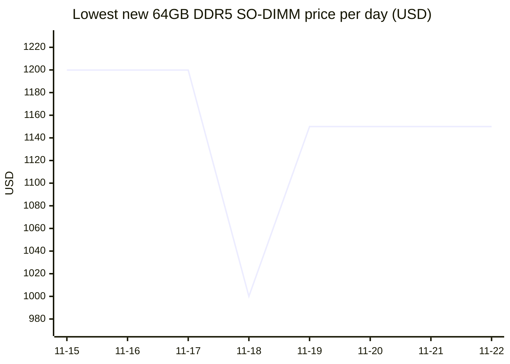
```mermaid
xychart-beta
    title "Lowest new 64GB DDR5 SO-DIMM price per day (USD)"
    x-axis ["11-15", "11-16", "11-17", "11-18", "11-19", "11-20", "11-21", "11-22"]
    y-axis "USD" 970 --> 1230
    line [1199.89, 1199.89, 1199.89, 1000.00, 1149.99, 1149.99, 1149.99, 1149.99]
```

#### Latest price by item (new, cheapest store)

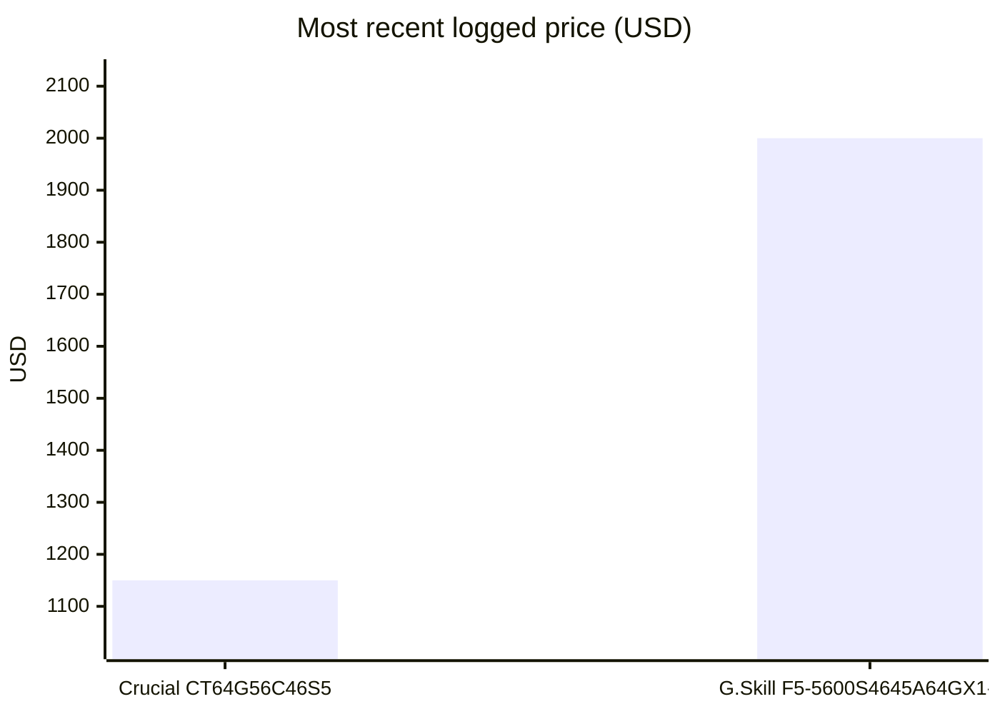
```mermaid
xychart-beta
    title "Most recent logged price (USD)"
    x-axis ["Crucial CT64G56C46S5", "G.Skill F5-5600S4645A64GX1-RS"]
    y-axis "USD" 1020 --> 2130
    bar [1149.99, 1999.99]
```

#### Latest prices

| Item | Spec | Store | Condition | Price | Change | As of | Basis | Link |
|---|---|---|---|--:|--:|---|---|---|
| Crucial CT64G56C46S5 | 1x64GB DDR5-5600 CL46 | eBay | used | **$1,099.99** | — | 2026-11-22 | direct | [link](https://www.ebay.com/itm/336908140792) |
| Crucial CT64G56C46S5 | 1x64GB DDR5-5600 CL46 | eBay | new | **$1,149.99** | — | 2026-11-22 | direct | [link](https://www.ebay.com/itm/327101326046) |
| Crucial CT64G56C46S5 | 1x64GB DDR5-5600 CL46 | Amazon (third-party seller) | new | **$1,199.89** | — | 2026-11-22 | direct | [link](https://www.amazon.com/dp/B0DSQWZ5G2) |
| G.Skill F5-5600S4645A64GX1-RS | 1x64GB DDR5-5600 CL46 | Amazon (third-party seller) | new | **$1,999.99** | — | 2026-11-22 | direct | [link](https://www.amazon.com/dp/B0G7RLK95V) |

<details>
<summary><b>RAM: price history</b></summary>

##### Crucial CT64G56C46S5 — Amazon (third-party seller) (new)
Low $1,199.89 · High $1,199.89 · 8 entries

| Date | Price | Basis |
|---|--:|---|
| 2026-11-22 | [$1,199.89](https://www.amazon.com/dp/B0DSQWZ5G2) | direct |
| 2026-11-21 | [$1,199.89](https://www.amazon.com/dp/B0DSQWZ5G2) | direct |
| 2026-11-20 | [$1,199.89](https://www.amazon.com/dp/B0DSQWZ5G2) | direct |
| 2026-11-19 | [$1,199.89](https://www.amazon.com/dp/B0DSQWZ5G2) | direct |
| 2026-11-18 | [$1,199.89](https://www.amazon.com/dp/B0DSQWZ5G2) | direct |
| 2026-11-17 | [$1,199.89](https://www.amazon.com/dp/B0DSQWZ5G2) | direct |
| 2026-11-16 | [$1,199.89](https://www.amazon.com/dp/B0DSQWZ5G2) | direct |
| 2026-11-15 | [$1,199.89](https://www.amazon.com/dp/B0DSQWZ5G2) | direct |

##### Crucial CT64G56C46S5 — eBay (new)
Low $1,000.00 · High $1,149.99 · 5 entries

| Date | Price | Basis |
|---|--:|---|
| 2026-11-22 | [$1,149.99](https://www.ebay.com/itm/327101326046) | direct |
| 2026-11-21 | [$1,149.99](https://www.ebay.com/itm/327101326046) | direct |
| 2026-11-20 | [$1,149.99](https://www.ebay.com/itm/327101326046) | direct |
| 2026-11-19 | [$1,149.99](https://www.ebay.com/itm/327101326046) | direct |
| 2026-11-18 | [$1,000.00](https://www.ebay.com/itm/800738984634) | direct |

##### Crucial CT64G56C46S5 — eBay (used)
Low $1,099.99 · High $1,099.99 · 2 entries

| Date | Price | Basis |
|---|--:|---|
| 2026-11-22 | [$1,099.99](https://www.ebay.com/itm/336908140792) | direct |
| 2026-11-21 | [$1,099.99](https://www.ebay.com/itm/336908140792) | direct |

##### G.Skill F5-5600S4645A64GX1-RS — Amazon (third-party seller) (new)
Low $1,999.99 · High $1,999.99 · 8 entries

| Date | Price | Basis |
|---|--:|---|
| 2026-11-22 | [$1,999.99](https://www.amazon.com/dp/B0G7RLK95V) | direct |
| 2026-11-21 | [$1,999.99](https://www.amazon.com/dp/B0G7RLK95V) | direct |
| 2026-11-20 | [$1,999.99](https://www.amazon.com/dp/B0G7RLK95V) | direct |
| 2026-11-19 | [$1,999.99](https://www.amazon.com/dp/B0G7RLK95V) | direct |
| 2026-11-18 | [$1,999.99](https://www.amazon.com/dp/B0G7RLK95V) | direct |
| 2026-11-17 | [$1,999.99](https://www.amazon.com/dp/B0G7RLK95V) | direct |
| 2026-11-16 | [$1,999.99](https://www.amazon.com/dp/B0G7RLK95V) | direct |
| 2026-11-15 | [$1,999.99](https://www.amazon.com/dp/B0G7RLK95V) | direct |

</details>

### NVIDIA GPUs

> **Cheapest new NVIDIA GPU on 2026-11-22:** RTX 3090 Ti (24GB GDDR6X) at **$2,150.00** (Amazon) — [source](https://www.amazon.com/dp/B0BKH8HDWK)

#### Cheapest by model

| Model | Cheapest new | Cheapest used / refurbished |
|---|---|---|
| RTX 5090 | [$6,349.99](https://www.newegg.com/asus-rog-astral-rog-astral-rtx5090-p32g-edition20-geforce-rtx-5090-32gb-video-card-triple-fans/p/N82E16814126846?item=N82E16814126846) Newegg, 2026-11-22 | [$5,749.00](https://www.ebay.com/itm/860153194427) eBay, 2026-11-19 |
| RTX 4090 | [$4,449.00](https://www.amazon.com/dp/B0CPB3P36K) Amazon, 2026-11-22 | [$1,300.00](https://www.ebay.com/itm/366745135471) eBay, 2026-11-22 |
| RTX 3090 Ti | [$2,150.00](https://www.amazon.com/dp/B0BKH8HDWK) Amazon, 2026-11-22 | [$1,999.00](https://www.ebay.com/itm/287722082549) eBay, 2026-11-22 |
| RTX 3090 | [$2,225.00](https://www.amazon.com/dp/B09GWB753L) Amazon, 2026-11-22 | [$1,748.00](https://www.ebay.com/itm/820086037765) eBay, 2026-11-22 |

<sub>Uses the most recent logged price for each item, store and condition.</sub>

#### Latest new price by model (cheapest store)

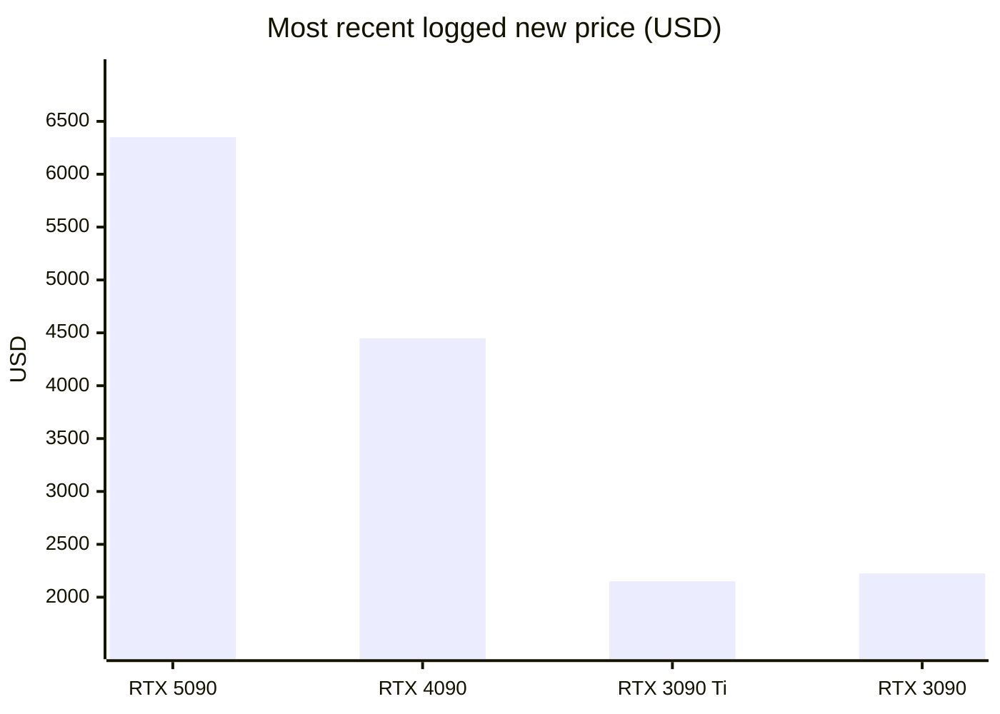
```mermaid
xychart-beta
    title "Most recent logged new price (USD)"
    x-axis ["RTX 5090", "RTX 4090", "RTX 3090 Ti", "RTX 3090"]
    y-axis "USD" 1520 --> 6980
    bar [6349.99, 4449.00, 2150.00, 2225.00]
```

<details>
<summary><b>New price over time, by model</b></summary>

#### RTX 5090: cheapest new price over time

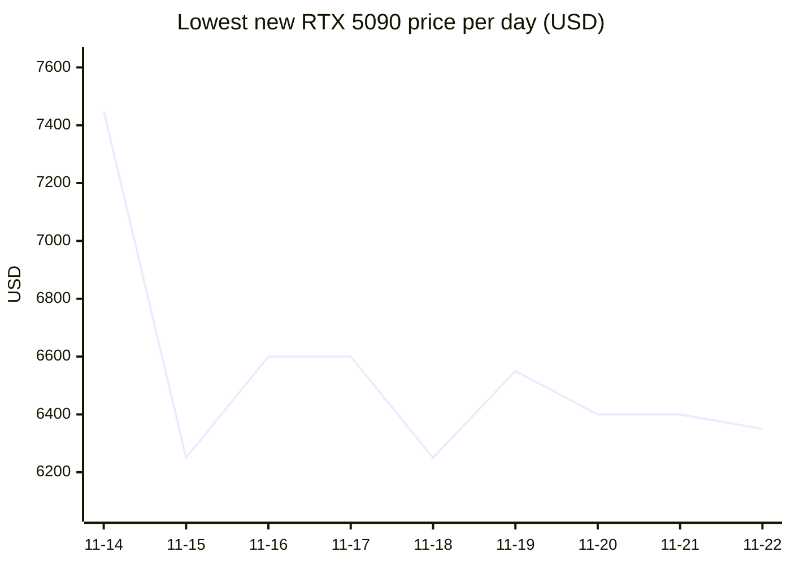
```mermaid
xychart-beta
    title "Lowest new RTX 5090 price per day (USD)"
    x-axis ["11-14", "11-15", "11-16", "11-17", "11-18", "11-19", "11-20", "11-21", "11-22"]
    y-axis "USD" 6060 --> 7640
    line [7450.00, 6249.99, 6599.99, 6599.99, 6249.99, 6549.99, 6399.99, 6399.99, 6349.99]
```

#### RTX 4090: cheapest new price over time


```mermaid
xychart-beta
    title "Lowest new RTX 4090 price per day (USD)"
    x-axis ["11-15", "11-16", "11-17", "11-18", "11-19", "11-20", "11-21", "11-22"]
    y-axis "USD" 4290 --> 5660
    line [5500.00, 5500.00, 4449.00, 4449.00, 4449.00, 4449.00, 4449.00, 4449.00]
```

#### RTX 3090 Ti: cheapest new price over time

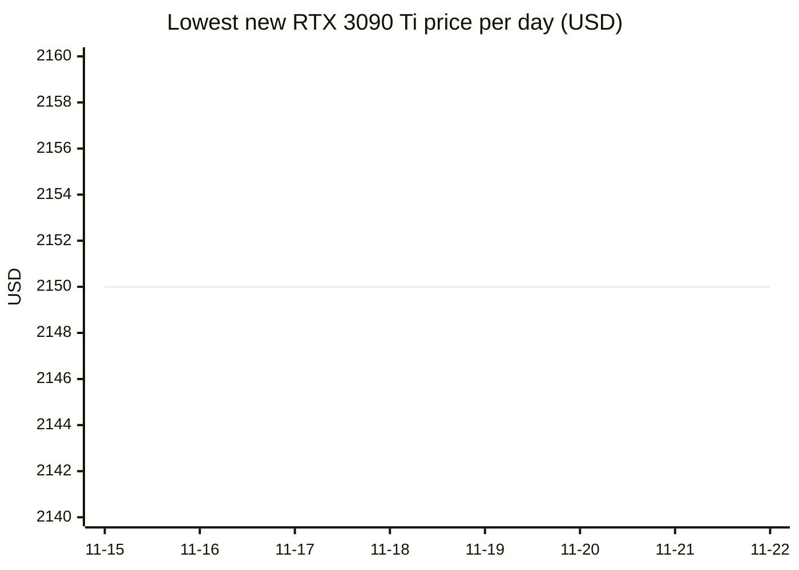
```mermaid
xychart-beta
    title "Lowest new RTX 3090 Ti price per day (USD)"
    x-axis ["11-15", "11-16", "11-17", "11-18", "11-19", "11-20", "11-21", "11-22"]
    y-axis "USD" 2140 --> 2160
    line [2150.00, 2150.00, 2150.00, 2150.00, 2150.00, 2150.00, 2150.00, 2150.00]
```

#### RTX 3090: cheapest new price over time

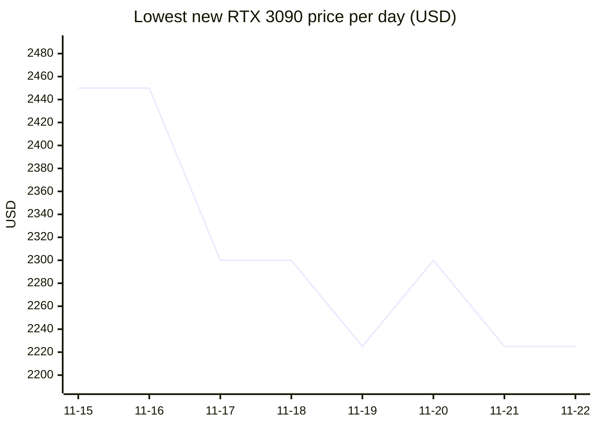
```mermaid
xychart-beta
    title "Lowest new RTX 3090 price per day (USD)"
    x-axis ["11-15", "11-16", "11-17", "11-18", "11-19", "11-20", "11-21", "11-22"]
    y-axis "USD" 2190 --> 2490
    line [2450.00, 2450.00, 2300.00, 2300.00, 2225.00, 2300.00, 2225.00, 2225.00]
```

</details>

#### Latest prices

| Model | Item | Spec | Store | Condition | Price | Change | As of | Basis | Link |
|---|---|---|---|---|--:|--:|---|---|---|
| RTX 5090 | RTX 5090 (Gigabyte GAMING OC) | 32GB GDDR7 | eBay | used | **$5,749.00** | new | 2026-11-19 | reported (videocardprices.com) | [link](https://www.ebay.com/itm/860153194427) |
| RTX 5090 | RTX 5090 (Gigabyte Gaming OC) | 32GB GDDR7 | eBay | used | **$5,750.00** | — | 2026-11-18 | reported (videocardprices.com) | [link](https://www.ebay.com/itm/407331778909) |
| RTX 5090 | RTX 5090 (ASUS ROG Astral OC) | 32GB GDDR7 | eBay | used | **$5,999.00** | new | 2026-11-15 | reported (videocardprices.com) | [link](https://www.ebay.com/itm/880090793238) |
| RTX 5090 | RTX 5090 (Gigabyte AORUS Master) | 32GB GDDR7 | eBay | used | **$5,999.00** | new | 2026-11-20 | reported (videocardprices.com) | [link](https://www.ebay.com/itm/880045706132) |
| RTX 5090 | RTX 5090 (MSI VENTUS OC) | 32GB GDDR7 | eBay | used | **$5,999.00** | new | 2026-11-21 | reported (videocardprices.com) | [link](https://www.ebay.com/itm/407351329773) |
| RTX 5090 | RTX 5090 (MSI) | 32GB GDDR7 | eBay | used | **$6,000.00** | new | 2026-11-22 | reported (videocardprices.com) | [link](https://www.ebay.com/itm/860138968144) |
| RTX 5090 | RTX 5090 (ASUS ProArt OC) | 32GB GDDR7 | Newegg | new | **$6,349.99** | new | 2026-11-22 | reported (videocardprices.com) | [link](https://www.newegg.com/asus-rog-astral-rog-astral-rtx5090-p32g-edition20-geforce-rtx-5090-32gb-video-card-triple-fans/p/N82E16814126846?item=N82E16814126846) |
| RTX 5090 | RTX 5090 (ASUS ROG Astral OC) | 32GB GDDR7 | Newegg | new | **$6,399.99** | — | 2026-11-21 | reported (videocardprices.com) | [link](https://www.newegg.com/asus-rog-astral-rog-astral-rtx5090-o32g-gaming-geforce-rtx-5090-32gb-graphics-card-triple-fans/p/N82E16814126751?item=N82E16814126751) |
| RTX 5090 | RTX 5090 (GIGABYTE Gaming) | 32GB GDDR7 | Newegg | new | **$6,549.99** | new | 2026-11-19 | reported (videocardprices.com) | [link](https://www.newegg.com/gigabyte-gv-n5090gaming-oc-32gd-geforce-rtx-5090-32gb-graphics-card-triple-fans/p/N82E16814932761?item=N82E16814932761) |
| RTX 5090 | RTX 5090 (GIGABYTE AORUS) | 32GB GDDR7 | Newegg | new | **$6,599.99** | — | 2026-11-17 | reported (videocardprices.com) | [link](https://www.newegg.com/gigabyte-gv-n5090aorusx-w-32gd-geforce-rtx-5090-32gb-graphics-card/p/N82E16814932763?item=N82E16814932763) |
| RTX 5090 | RTX 5090 (ASUS TUF Gaming OC) | 32GB GDDR7 | Amazon | new | **$7,350.00** | — | 2026-11-22 | reported (videocardprices.com) | [link](https://www.amazon.com/dp/B0DS2X13PH) |
| RTX 4090 | RTX 4090 | 24GB GDDR6X | eBay | used | **$1,300.00** | — | 2026-11-22 | reported (gpudeals.net) | [link](https://www.ebay.com/itm/366745135471) |
| RTX 4090 | RTX 4090 | 24GB GDDR6X | Amazon | new | **$4,449.00** | — | 2026-11-22 | reported (gpudeals.net) | [link](https://www.amazon.com/dp/B0CPB3P36K) |
| RTX 3090 Ti | RTX 3090 Ti | 24GB GDDR6X | eBay | used | **$1,999.00** | — | 2026-11-22 | reported (gpudeals.net) | [link](https://www.ebay.com/itm/287722082549) |
| RTX 3090 Ti | RTX 3090 Ti | 24GB GDDR6X | Amazon | new | **$2,150.00** | — | 2026-11-22 | reported (gpudeals.net) | [link](https://www.amazon.com/dp/B0BKH8HDWK) |
| RTX 3090 | RTX 3090 | 24GB GDDR6X | eBay | used | **$1,748.00** | — | 2026-11-22 | reported (gpudeals.net) | [link](https://www.ebay.com/itm/820086037765) |
| RTX 3090 | RTX 3090 (NVIDIA Founders Edition) | 24GB GDDR6X | Amazon (third-party seller) | used | **$1,799.22** | new | 2026-11-14 | reported (camelcamelcamel) | [link](https://camelcamelcamel.com/product/B08HR6ZBYJ) |
| RTX 3090 | RTX 3090 | 24GB GDDR6X | Amazon | new | **$2,225.00** | — | 2026-11-22 | reported (gpudeals.net) | [link](https://www.amazon.com/dp/B09GWB753L) |

<details>
<summary><b>NVIDIA GPUs: price history</b></summary>

##### RTX 3090 — Amazon (new)
Low $2,225.00 · High $2,450.00 · 8 entries

| Date | Price | Basis |
|---|--:|---|
| 2026-11-22 | [$2,225.00](https://www.amazon.com/dp/B09GWB753L) | reported (gpudeals.net) |
| 2026-11-21 | [$2,225.00](https://www.amazon.com/dp/B09GWB753L) | reported (gpudeals.net) |
| 2026-11-20 | [$2,300.00](https://www.amazon.com/dp/B09GWB753L) | reported (gpudeals.net) |
| 2026-11-19 | [$2,225.00](https://www.amazon.com/dp/B09GWB753L) | reported (gpudeals.net) |
| 2026-11-18 | [$2,300.00](https://www.amazon.com/dp/B09GWB753L) | reported (gpudeals.net) |
| 2026-11-17 | [$2,300.00](https://www.amazon.com/dp/B09GWB753L) | reported (gpudeals.net) |
| 2026-11-16 | [$2,450.00](https://www.amazon.com/dp/B09GWB753L) | reported (gpudeals.net) |
| 2026-11-15 | [$2,450.00](https://www.amazon.com/dp/B09GWB753L) | reported (gpudeals.net) |

##### RTX 3090 — eBay (used)
Low $1,490.00 · High $1,748.00 · 8 entries

| Date | Price | Basis |
|---|--:|---|
| 2026-11-22 | [$1,748.00](https://www.ebay.com/itm/820086037765) | reported (gpudeals.net) |
| 2026-11-21 | [$1,748.00](https://www.ebay.com/itm/820086037765) | reported (gpudeals.net) |
| 2026-11-20 | [$1,748.00](https://www.ebay.com/itm/820086037765) | reported (gpudeals.net) |
| 2026-11-19 | [$1,748.00](https://www.ebay.com/itm/820086037765) | reported (gpudeals.net) |
| 2026-11-18 | [$1,490.00](https://www.ebay.com/itm/287671509732) | reported (gpudeals.net) |
| 2026-11-17 | [$1,490.00](https://www.ebay.com/itm/287671509732) | reported (gpudeals.net) |
| 2026-11-16 | [$1,500.00](https://www.ebay.com/itm/287671509732) | reported (gpudeals.net) |
| 2026-11-15 | [$1,500.00](https://www.ebay.com/itm/287671509732) | reported (gpudeals.net) |

##### RTX 3090 (NVIDIA Founders Edition) — Amazon (third-party seller) (used)
Low $1,799.22 · High $1,799.22 · 1 entry

| Date | Price | Basis |
|---|--:|---|
| 2026-11-14 | [$1,799.22](https://camelcamelcamel.com/product/B08HR6ZBYJ) | reported (camelcamelcamel) |

##### RTX 3090 Ti — Amazon (new)
Low $2,150.00 · High $2,150.00 · 8 entries

| Date | Price | Basis |
|---|--:|---|
| 2026-11-22 | [$2,150.00](https://www.amazon.com/dp/B0BKH8HDWK) | reported (gpudeals.net) |
| 2026-11-21 | [$2,150.00](https://www.amazon.com/dp/B0BKH8HDWK) | reported (gpudeals.net) |
| 2026-11-20 | [$2,150.00](https://www.amazon.com/dp/B0BKH8HDWK) | reported (gpudeals.net) |
| 2026-11-19 | [$2,150.00](https://www.amazon.com/dp/B0BKH8HDWK) | reported (gpudeals.net) |
| 2026-11-18 | [$2,150.00](https://www.amazon.com/dp/B0BKH8HDWK) | reported (gpudeals.net) |
| 2026-11-17 | [$2,150.00](https://www.amazon.com/dp/B0BKH8HDWK) | reported (gpudeals.net) |
| 2026-11-16 | [$2,150.00](https://www.amazon.com/dp/B0BKH8HDWK) | reported (gpudeals.net) |
| 2026-11-15 | [$2,150.00](https://www.amazon.com/dp/B0BKH8HDWK) | reported (gpudeals.net) |

##### RTX 3090 Ti — eBay (used)
Low $1,800.00 · High $1,999.00 · 8 entries

| Date | Price | Basis |
|---|--:|---|
| 2026-11-22 | [$1,999.00](https://www.ebay.com/itm/287722082549) | reported (gpudeals.net) |
| 2026-11-21 | [$1,999.00](https://www.ebay.com/itm/287690227246) | reported (gpudeals.net) |
| 2026-11-20 | [$1,800.00](https://www.ebay.com/itm/820194234753) | reported (gpudeals.net) |
| 2026-11-19 | [$1,800.00](https://www.ebay.com/itm/820194234753) | reported (gpudeals.net) |
| 2026-11-18 | [$1,800.00](https://www.ebay.com/itm/820194234753) | reported (gpudeals.net) |
| 2026-11-17 | [$1,800.00](https://www.ebay.com/itm/820194234753) | reported (gpudeals.net) |
| 2026-11-16 | [$1,800.00](https://www.ebay.com/itm/820194234753) | reported (gpudeals.net) |
| 2026-11-15 | [$1,895.00](https://www.ebay.com/itm/366810925420) | reported (gpudeals.net) |

##### RTX 4090 — Amazon (new)
Low $4,449.00 · High $5,500.00 · 8 entries

| Date | Price | Basis |
|---|--:|---|
| 2026-11-22 | [$4,449.00](https://www.amazon.com/dp/B0CPB3P36K) | reported (gpudeals.net) |
| 2026-11-21 | [$4,449.00](https://www.amazon.com/dp/B0CPB3P36K) | reported (gpudeals.net) |
| 2026-11-20 | [$4,449.00](https://www.amazon.com/dp/B0CPB3P36K) | reported (gpudeals.net) |
| 2026-11-19 | [$4,449.00](https://www.amazon.com/dp/B0CPB3P36K) | reported (gpudeals.net) |
| 2026-11-18 | [$4,449.00](https://www.amazon.com/dp/B0CPB3P36K) | reported (gpudeals.net) |
| 2026-11-17 | [$4,449.00](https://www.amazon.com/dp/B0CPB3P36K) | reported (gpudeals.net) |
| 2026-11-16 | [$5,500.00](https://www.amazon.com/dp/B0BJFRT43X) | reported (gpudeals.net) |
| 2026-11-15 | [$5,500.00](https://www.amazon.com/dp/B0BJFRT43X) | reported (gpudeals.net) |

##### RTX 4090 — eBay (used)
Low $1,300.00 · High $1,300.00 · 8 entries

| Date | Price | Basis |
|---|--:|---|
| 2026-11-22 | [$1,300.00](https://www.ebay.com/itm/366745135471) | reported (gpudeals.net) |
| 2026-11-21 | [$1,300.00](https://www.ebay.com/itm/366745135471) | reported (gpudeals.net) |
| 2026-11-20 | [$1,300.00](https://www.ebay.com/itm/366745135471) | reported (gpudeals.net) |
| 2026-11-19 | [$1,300.00](https://www.ebay.com/itm/366745135471) | reported (gpudeals.net) |
| 2026-11-18 | [$1,300.00](https://www.ebay.com/itm/366745135471) | reported (gpudeals.net) |
| 2026-11-17 | [$1,300.00](https://www.ebay.com/itm/366745135471) | reported (gpudeals.net) |
| 2026-11-16 | [$1,300.00](https://www.ebay.com/itm/366745135471) | reported (gpudeals.net) |
| 2026-11-15 | [$1,300.00](https://www.ebay.com/itm/366745135471) | reported (gpudeals.net) |

##### RTX 5090 (ASUS ProArt OC) — Newegg (new)
Low $6,349.99 · High $6,349.99 · 1 entry

| Date | Price | Basis |
|---|--:|---|
| 2026-11-22 | [$6,349.99](https://www.newegg.com/asus-rog-astral-rog-astral-rtx5090-p32g-edition20-geforce-rtx-5090-32gb-video-card-triple-fans/p/N82E16814126846?item=N82E16814126846) | reported (videocardprices.com) |

##### RTX 5090 (ASUS ROG Astral OC) — Newegg (new)
Low $6,249.99 · High $6,399.99 · 4 entries

| Date | Price | Basis |
|---|--:|---|
| 2026-11-21 | [$6,399.99](https://www.newegg.com/asus-rog-astral-rog-astral-rtx5090-o32g-gaming-geforce-rtx-5090-32gb-graphics-card-triple-fans/p/N82E16814126751?item=N82E16814126751) | reported (videocardprices.com) |
| 2026-11-20 | [$6,399.99](https://www.newegg.com/asus-rog-astral-rog-astral-rtx5090-o32g-gaming-geforce-rtx-5090-32gb-graphics-card-triple-fans/p/N82E16814126751?item=N82E16814126751) | reported (videocardprices.com) |
| 2026-11-18 | [$6,249.99](https://www.newegg.com/asus-rog-astral-rog-astral-rtx5090-o32g-gaming-geforce-rtx-5090-32gb-graphics-card-triple-fans/p/N82E16814126751?item=N82E16814126751) | reported (videocardprices.com) |
| 2026-11-15 | [$6,249.99](https://www.newegg.com/asus-rog-astral-rog-astral-rtx5090-o32g-gaming-geforce-rtx-5090-32gb-graphics-card-triple-fans/p/N82E16814126751?item=N82E16814126751) | reported (videocardprices.com) |

##### RTX 5090 (ASUS ROG Astral OC) — eBay (used)
Low $5,999.00 · High $5,999.00 · 1 entry

| Date | Price | Basis |
|---|--:|---|
| 2026-11-15 | [$5,999.00](https://www.ebay.com/itm/880090793238) | reported (videocardprices.com) |

##### RTX 5090 (ASUS TUF Gaming OC) — Amazon (new)
Low $7,350.00 · High $7,450.00 · 10 entries

| Date | Price | Basis |
|---|--:|---|
| 2026-11-22 | [$7,350.00](https://www.amazon.com/dp/B0DS2X13PH) | reported (videocardprices.com) |
| 2026-11-21 | [$7,350.00](https://www.amazon.com/dp/B0DS2X13PH) | reported (videocardprices.com) |
| 2026-11-20 | [$7,350.00](https://www.amazon.com/dp/B0DS2X13PH) | reported (videocardprices.com) |
| 2026-11-19 | [$7,350.00](https://www.amazon.com/dp/B0DS2X13PH) | reported (videocardprices.com) |
| 2026-11-18 | [$7,400.00](https://www.amazon.com/dp/B0DS2X13PH) | reported (videocardprices.com) |
| 2026-11-17 | [$7,444.44](https://www.amazon.com/dp/B0DS2X13PH) | reported (videocardprices.com) |
| 2026-11-16 | [$7,450.00](https://www.amazon.com/dp/B0DS2X13PH) | reported (videocardprices.com) |
| 2026-11-15 | [$7,450.00](https://videocardprices.com/card/nvidia-rtx-5090/) | reported (videocardprices.com) |
| 2026-11-14 | [$7,450.00](https://videocardprices.com/card/nvidia-rtx-5090/) | reported (videocardprices.com) |
| 2026-11-14 | [$7,450.00](https://videocardprices.com/card/nvidia-rtx-5090/) | reported (videocardprices.com) |

##### RTX 5090 (GIGABYTE AORUS) — Newegg (new)
Low $6,599.99 · High $6,599.99 · 2 entries

| Date | Price | Basis |
|---|--:|---|
| 2026-11-17 | [$6,599.99](https://www.newegg.com/gigabyte-gv-n5090aorusx-w-32gd-geforce-rtx-5090-32gb-graphics-card/p/N82E16814932763?item=N82E16814932763) | reported (videocardprices.com) |
| 2026-11-16 | [$6,599.99](https://www.newegg.com/gigabyte-gv-n5090aorusx-w-32gd-geforce-rtx-5090-32gb-graphics-card/p/N82E16814932763?item=N82E16814932763) | reported (videocardprices.com) |

##### RTX 5090 (GIGABYTE Gaming) — Newegg (new)
Low $6,549.99 · High $6,549.99 · 1 entry

| Date | Price | Basis |
|---|--:|---|
| 2026-11-19 | [$6,549.99](https://www.newegg.com/gigabyte-gv-n5090gaming-oc-32gd-geforce-rtx-5090-32gb-graphics-card-triple-fans/p/N82E16814932761?item=N82E16814932761) | reported (videocardprices.com) |

##### RTX 5090 (Gigabyte AORUS Master) — eBay (used)
Low $5,999.00 · High $5,999.00 · 1 entry

| Date | Price | Basis |
|---|--:|---|
| 2026-11-20 | [$5,999.00](https://www.ebay.com/itm/880045706132) | reported (videocardprices.com) |

##### RTX 5090 (Gigabyte GAMING OC) — eBay (used)
Low $5,749.00 · High $5,749.00 · 1 entry

| Date | Price | Basis |
|---|--:|---|
| 2026-11-19 | [$5,749.00](https://www.ebay.com/itm/860153194427) | reported (videocardprices.com) |

##### RTX 5090 (Gigabyte Gaming OC) — eBay (used)
Low $5,750.00 · High $5,750.00 · 3 entries

| Date | Price | Basis |
|---|--:|---|
| 2026-11-18 | [$5,750.00](https://www.ebay.com/itm/407331778909) | reported (videocardprices.com) |
| 2026-11-17 | [$5,750.00](https://www.ebay.com/itm/407331778909) | reported (videocardprices.com) |
| 2026-11-16 | [$5,750.00](https://www.ebay.com/itm/407331778909) | reported (videocardprices.com) |

##### RTX 5090 (MSI VENTUS OC) — eBay (used)
Low $5,999.00 · High $5,999.00 · 1 entry

| Date | Price | Basis |
|---|--:|---|
| 2026-11-21 | [$5,999.00](https://www.ebay.com/itm/407351329773) | reported (videocardprices.com) |

##### RTX 5090 (MSI) — eBay (used)
Low $6,000.00 · High $6,000.00 · 1 entry

| Date | Price | Basis |
|---|--:|---|
| 2026-11-22 | [$6,000.00](https://www.ebay.com/itm/860138968144) | reported (videocardprices.com) |

</details>

### AMD GPUs

> **Cheapest new AMD GPU on 2026-11-22:** RX 9070 (XFX Swift OC Triple Fan) (16GB GDDR6) at **$879.99** (Amazon) — [source](https://www.amazon.com/dp/B0DXLBTL4B)

#### Cheapest by model

| Model | Cheapest new | Cheapest used / refurbished |
|---|---|---|
| RX 9070 XT | [$979.99](https://www.newegg.com/asrock-challenger-rx9070xt-cl-16g-radeon-rx-9070-xt-16gb-graphics-card-triple-fans/p/N82E16814930145?item=N82E16814930145) Newegg, 2026-11-21 | [$820.00](https://www.ebay.com/itm/840143580053) eBay, 2026-11-20 |
| RX 9070 | [$879.99](https://www.amazon.com/dp/B0DXLBTL4B) Amazon, 2026-11-22 | [$800.00](https://www.ebay.com/itm/267843983228) eBay, 2026-11-22 |
| RX 7900 XTX | [$1,099.99](https://www.amazon.com/dp/B0BTPK5J68) Amazon, 2026-11-22 | [$950.00](https://www.ebay.com/itm/800926620046) eBay, 2026-11-19 |
| RX 7900 XT | [$946.00](https://www.amazon.com/dp/B0BMNGT8XM) Amazon, 2026-11-22 | [$970.00](https://www.ebay.com/itm/407201083826) eBay, 2026-11-22 |

<sub>Uses the most recent logged price for each item, store and condition.</sub>

#### Latest new price by model (cheapest store)

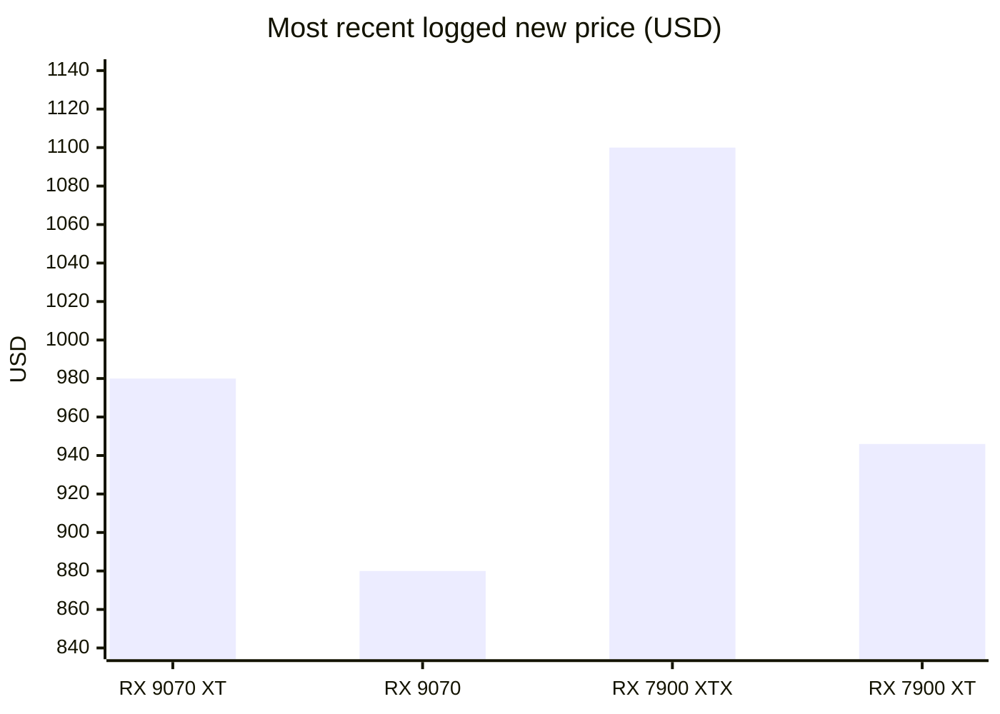
```mermaid
xychart-beta
    title "Most recent logged new price (USD)"
    x-axis ["RX 9070 XT", "RX 9070", "RX 7900 XTX", "RX 7900 XT"]
    y-axis "USD" 840 --> 1140
    bar [979.99, 879.99, 1099.99, 946.00]
```

<details>
<summary><b>New price over time, by model</b></summary>

#### RX 9070 XT: cheapest new price over time

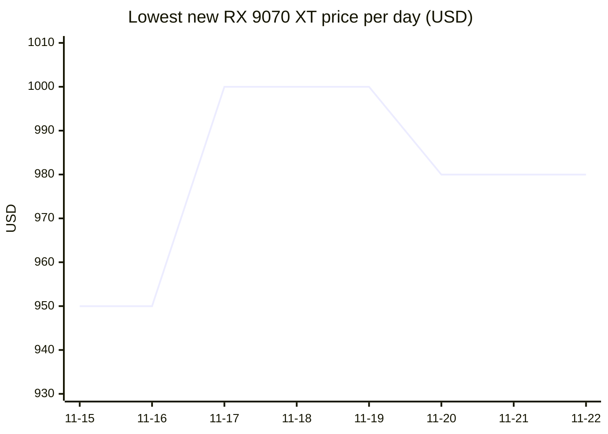
```mermaid
xychart-beta
    title "Lowest new RX 9070 XT price per day (USD)"
    x-axis ["11-15", "11-16", "11-17", "11-18", "11-19", "11-20", "11-21", "11-22"]
    y-axis "USD" 930 --> 1010
    line [949.99, 949.99, 999.99, 999.99, 999.99, 979.99, 979.99, 979.99]
```

#### RX 9070: cheapest new price over time

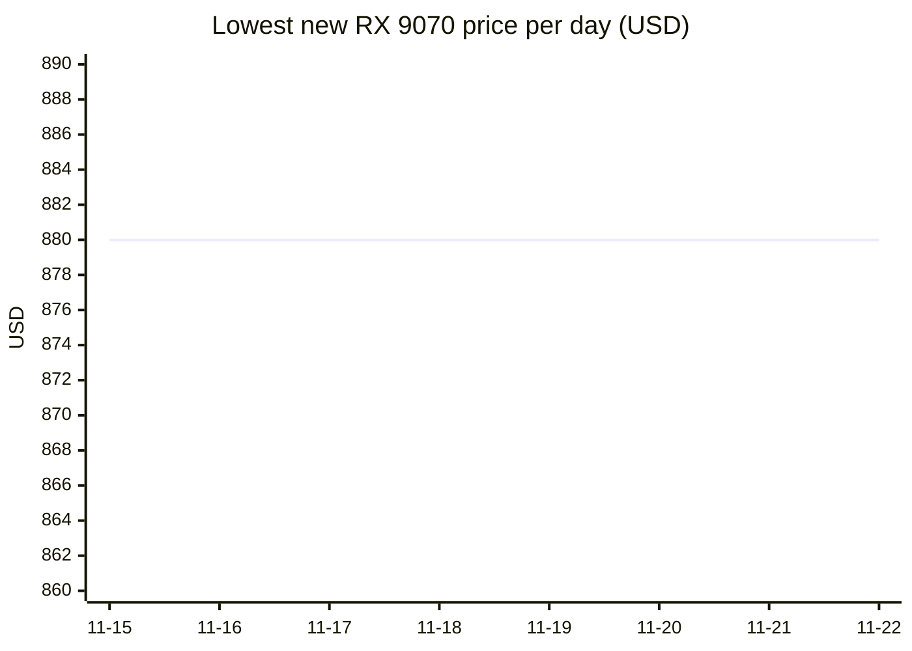
```mermaid
xychart-beta
    title "Lowest new RX 9070 price per day (USD)"
    x-axis ["11-15", "11-16", "11-17", "11-18", "11-19", "11-20", "11-21", "11-22"]
    y-axis "USD" 860 --> 890
    line [879.99, 879.99, 879.99, 879.99, 879.99, 879.99, 879.99, 879.99]
```

#### RX 7900 XTX: cheapest new price over time

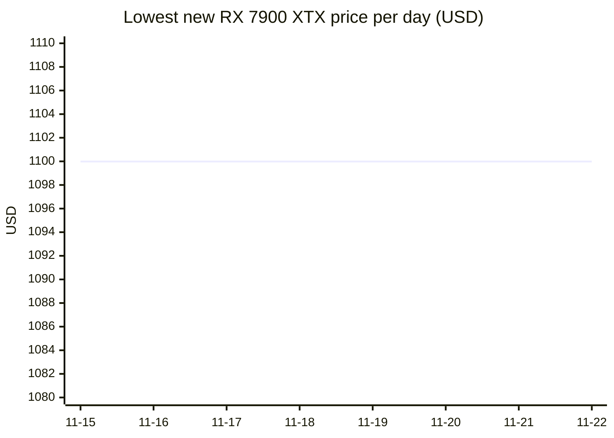
```mermaid
xychart-beta
    title "Lowest new RX 7900 XTX price per day (USD)"
    x-axis ["11-15", "11-16", "11-17", "11-18", "11-19", "11-20", "11-21", "11-22"]
    y-axis "USD" 1080 --> 1110
    line [1099.99, 1099.99, 1099.99, 1099.99, 1099.99, 1099.99, 1099.99, 1099.99]
```

#### RX 7900 XT: cheapest new price over time

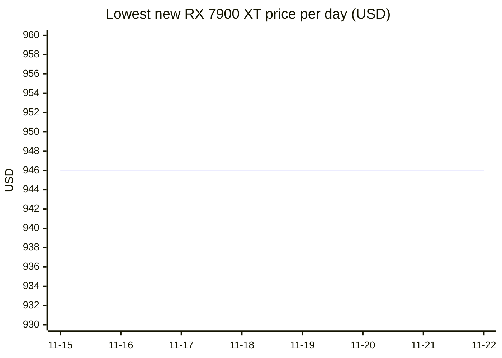
```mermaid
xychart-beta
    title "Lowest new RX 7900 XT price per day (USD)"
    x-axis ["11-15", "11-16", "11-17", "11-18", "11-19", "11-20", "11-21", "11-22"]
    y-axis "USD" 930 --> 960
    line [946.00, 946.00, 946.00, 946.00, 946.00, 946.00, 946.00, 946.00]
```

</details>

#### Latest prices

| Model | Item | Spec | Store | Condition | Price | Change | As of | Basis | Link |
|---|---|---|---|---|--:|--:|---|---|---|
| RX 9070 XT | RX 9070 XT (XFX Swift Triple Fan HDMI) | 16GB GDDR6 | eBay | used | **$820.00** | new | 2026-11-20 | reported (videocardprices.com) | [link](https://www.ebay.com/itm/840143580053) |
| RX 9070 XT | RX 9070 XT (XFX Black) | 16GB GDDR6 | eBay | used | **$850.00** | new | 2026-11-19 | reported (videocardprices.com) | [link](https://www.ebay.com/itm/227620281550) |
| RX 9070 XT | RX 9070 XT (ASUS Prime OC) | 16GB GDDR6 | eBay | used | **$879.00** | 🔺 $59.00 | 2026-11-21 | reported (videocardprices.com) | [link](https://www.ebay.com/itm/147689700087) |
| RX 9070 XT | RX 9070 XT (GIGABYTE Gaming OC Windforce) | 16GB GDDR6 | eBay | used | **$880.00** | new | 2026-11-22 | reported (videocardprices.com) | [link](https://www.ebay.com/itm/206717711694) |
| RX 9070 XT | RX 9070 XT (PowerColor OC) | 16GB GDDR6 | eBay | used | **$899.00** | new | 2026-11-15 | reported (videocardprices.com) | [link](https://www.ebay.com/itm/168853292500) |
| RX 9070 XT | RX 9070 XT (GIGABYTE Gaming OC) | 16GB GDDR6 | eBay | used | **$925.00** | new | 2026-11-17 | reported (videocardprices.com) | [link](https://www.ebay.com/itm/840132001019) |
| RX 9070 XT | RX 9070 XT (XFX Gaming) | 16GB GDDR6 | eBay | used | **$929.97** | new | 2026-11-16 | reported (videocardprices.com) | [link](https://www.ebay.com/itm/117519818319) |
| RX 9070 XT | RX 9070 XT (ASRock Challenger) | 16GB GDDR6 | Newegg | new | **$979.99** | — | 2026-11-21 | reported (videocardprices.com) | [link](https://www.newegg.com/asrock-challenger-rx9070xt-cl-16g-radeon-rx-9070-xt-16gb-graphics-card-triple-fans/p/N82E16814930145?item=N82E16814930145) |
| RX 9070 XT | RX 9070 XT (XFX Mercury OC Gaming) | 16GB GDDR6 | Newegg | new | **$979.99** | new | 2026-11-22 | reported (videocardprices.com) | [link](https://www.newegg.com/xfx-mercury-rx-97trgbbba-radeon-rx-9070-xt-16gb-graphics-card-triple-fans/p/N82E16814150923?item=N82E16814150923) |
| RX 9070 XT | RX 9070 XT (ASRock Steel Legend) | 16GB GDDR6 | Newegg | new | **$999.99** | — | 2026-11-19 | reported (videocardprices.com) | [link](https://www.newegg.com/asrock-steel-legend-rx9070xt-sl-16g-radeon-rx-9070-xt-16gb-graphics-card-triple-fans/p/N82E16814930136?item=N82E16814930136) |
| RX 9070 XT | RX 9070 XT (GIGABYTE Gaming OC) | 16GB GDDR6 | Amazon | new | **$1,034.99** | — | 2026-11-22 | reported (videocardprices.com) | [link](https://www.amazon.com/dp/B0DS2QG2KW) |
| RX 9070 | RX 9070 (AsRock Challenger) | 16GB GDDR6 | eBay | used | **$800.00** | — | 2026-11-22 | reported (videocardprices.com) | [link](https://www.ebay.com/itm/267843983228) |
| RX 9070 | RX 9070 (ASRock Steel Legend) | 16GB GDDR6 | eBay | used | **$848.99** | new | 2026-11-15 | reported (videocardprices.com) | [link](https://www.ebay.com/itm/327453479284) |
| RX 9070 | RX 9070 (XFX Swift OC Triple Fan) | 16GB GDDR6 | Amazon | new | **$879.99** | — | 2026-11-22 | reported (videocardprices.com) | [link](https://www.amazon.com/dp/B0DXLBTL4B) |
| RX 9070 | RX 9070 (GIGABYTE Gaming) | 16GB GDDR6 | Newegg | new | **$934.99** | — | 2026-11-22 | reported (videocardprices.com) | [link](https://www.newegg.com/gigabyte-gv-r9070gaming-oc-16gd-radeon-rx-9070-16gb-graphics-card-triple-fans/p/N82E16814932752?item=N82E16814932752) |
| RX 7900 XTX | RX 7900 XTX (XFX Speedster MERC310 HDMI DP) | 24GB GDDR6 | eBay | used | **$950.00** | new | 2026-11-19 | reported (videocardprices.com) | [link](https://www.ebay.com/itm/800926620046) |
| RX 7900 XTX | RX 7900 XTX (ASRock Phantom Gaming OC) | 24GB GDDR6 | Amazon | new | **$1,099.99** | — | 2026-11-22 | reported (videocardprices.com) | [link](https://www.amazon.com/dp/B0BTPK5J68) |
| RX 7900 XT | RX 7900 XT | 20GB GDDR6 | Amazon | new | **$946.00** | — | 2026-11-22 | reported (gpudeals.net) | [link](https://www.amazon.com/dp/B0BMNGT8XM) |
| RX 7900 XT | RX 7900 XT | 20GB GDDR6 | eBay | used | **$970.00** | — | 2026-11-22 | reported (gpudeals.net) | [link](https://www.ebay.com/itm/407201083826) |

<details>
<summary><b>AMD GPUs: price history</b></summary>

##### RX 7900 XT — Amazon (new)
Low $946.00 · High $946.00 · 8 entries

| Date | Price | Basis |
|---|--:|---|
| 2026-11-22 | [$946.00](https://www.amazon.com/dp/B0BMNGT8XM) | reported (gpudeals.net) |
| 2026-11-21 | [$946.00](https://www.amazon.com/dp/B0BMNGT8XM) | reported (gpudeals.net) |
| 2026-11-20 | [$946.00](https://www.amazon.com/dp/B0BMNGT8XM) | reported (gpudeals.net) |
| 2026-11-19 | [$946.00](https://www.amazon.com/dp/B0BMNGT8XM) | reported (gpudeals.net) |
| 2026-11-18 | [$946.00](https://www.amazon.com/dp/B0BMNGT8XM) | reported (gpudeals.net) |
| 2026-11-17 | [$946.00](https://www.amazon.com/dp/B0BMNGT8XM) | reported (gpudeals.net) |
| 2026-11-16 | [$946.00](https://www.amazon.com/dp/B0BMNGT8XM) | reported (gpudeals.net) |
| 2026-11-15 | [$946.00](https://www.amazon.com/dp/B0BMNGT8XM) | reported (gpudeals.net) |

##### RX 7900 XT — eBay (used)
Low $875.00 · High $970.00 · 8 entries

| Date | Price | Basis |
|---|--:|---|
| 2026-11-22 | [$970.00](https://www.ebay.com/itm/407201083826) | reported (gpudeals.net) |
| 2026-11-21 | [$970.00](https://www.ebay.com/itm/407201083826) | reported (gpudeals.net) |
| 2026-11-20 | [$970.00](https://www.ebay.com/itm/407201083826) | reported (gpudeals.net) |
| 2026-11-19 | [$875.00](https://www.ebay.com/itm/198803765805) | reported (gpudeals.net) |
| 2026-11-18 | [$970.00](https://www.ebay.com/itm/407201083826) | reported (gpudeals.net) |
| 2026-11-17 | [$970.00](https://www.ebay.com/itm/407201083826) | reported (gpudeals.net) |
| 2026-11-16 | [$900.00](https://www.ebay.com/itm/960194484387) | reported (gpudeals.net) |
| 2026-11-15 | [$900.00](https://www.ebay.com/itm/960194484387) | reported (gpudeals.net) |

##### RX 7900 XTX (ASRock Phantom Gaming OC) — Amazon (new)
Low $1,099.99 · High $1,099.99 · 8 entries

| Date | Price | Basis |
|---|--:|---|
| 2026-11-22 | [$1,099.99](https://www.amazon.com/dp/B0BTPK5J68) | reported (videocardprices.com) |
| 2026-11-21 | [$1,099.99](https://www.amazon.com/dp/B0BTPK5J68) | reported (videocardprices.com) |
| 2026-11-20 | [$1,099.99](https://www.amazon.com/dp/B0BTPK5J68) | reported (videocardprices.com) |
| 2026-11-19 | [$1,099.99](https://www.amazon.com/dp/B0BTPK5J68) | reported (videocardprices.com) |
| 2026-11-18 | [$1,099.99](https://www.amazon.com/dp/B0BTPK5J68) | reported (videocardprices.com) |
| 2026-11-17 | [$1,099.99](https://www.amazon.com/dp/B0BTPK5J68) | reported (videocardprices.com) |
| 2026-11-16 | [$1,099.99](https://www.amazon.com/dp/B0BTPK5J68) | reported (videocardprices.com) |
| 2026-11-15 | [$1,099.99](https://www.amazon.com/dp/B0BTPK5J68) | reported (videocardprices.com) |

##### RX 7900 XTX (XFX Speedster MERC310 HDMI DP) — eBay (used)
Low $950.00 · High $950.00 · 1 entry

| Date | Price | Basis |
|---|--:|---|
| 2026-11-19 | [$950.00](https://www.ebay.com/itm/800926620046) | reported (videocardprices.com) |

##### RX 9070 (ASRock Steel Legend) — eBay (used)
Low $848.99 · High $848.99 · 1 entry

| Date | Price | Basis |
|---|--:|---|
| 2026-11-15 | [$848.99](https://www.ebay.com/itm/327453479284) | reported (videocardprices.com) |

##### RX 9070 (AsRock Challenger) — eBay (used)
Low $800.00 · High $830.00 · 7 entries

| Date | Price | Basis |
|---|--:|---|
| 2026-11-22 | [$800.00](https://www.ebay.com/itm/267843983228) | reported (videocardprices.com) |
| 2026-11-21 | [$800.00](https://www.ebay.com/itm/267843983228) | reported (videocardprices.com) |
| 2026-11-20 | [$800.00](https://www.ebay.com/itm/267843983228) | reported (videocardprices.com) |
| 2026-11-19 | [$800.00](https://www.ebay.com/itm/267843983228) | reported (videocardprices.com) |
| 2026-11-18 | [$800.00](https://www.ebay.com/itm/267843983228) | reported (videocardprices.com) |
| 2026-11-17 | [$830.00](https://www.ebay.com/itm/267843983228) | reported (videocardprices.com) |
| 2026-11-16 | [$830.00](https://www.ebay.com/itm/267843983228) | reported (videocardprices.com) |

##### RX 9070 (GIGABYTE Gaming) — Newegg (new)
Low $934.99 · High $934.99 · 8 entries

| Date | Price | Basis |
|---|--:|---|
| 2026-11-22 | [$934.99](https://www.newegg.com/gigabyte-gv-r9070gaming-oc-16gd-radeon-rx-9070-16gb-graphics-card-triple-fans/p/N82E16814932752?item=N82E16814932752) | reported (videocardprices.com) |
| 2026-11-21 | [$934.99](https://www.newegg.com/gigabyte-gv-r9070gaming-oc-16gd-radeon-rx-9070-16gb-graphics-card-triple-fans/p/N82E16814932752?item=N82E16814932752) | reported (videocardprices.com) |
| 2026-11-20 | [$934.99](https://www.newegg.com/gigabyte-gv-r9070gaming-oc-16gd-radeon-rx-9070-16gb-graphics-card-triple-fans/p/N82E16814932752?item=N82E16814932752) | reported (videocardprices.com) |
| 2026-11-19 | [$934.99](https://www.newegg.com/gigabyte-gv-r9070gaming-oc-16gd-radeon-rx-9070-16gb-graphics-card-triple-fans/p/N82E16814932752?item=N82E16814932752) | reported (videocardprices.com) |
| 2026-11-18 | [$934.99](https://www.newegg.com/gigabyte-gv-r9070gaming-oc-16gd-radeon-rx-9070-16gb-graphics-card-triple-fans/p/N82E16814932752?item=N82E16814932752) | reported (videocardprices.com) |
| 2026-11-17 | [$934.99](https://www.newegg.com/gigabyte-gv-r9070gaming-oc-16gd-radeon-rx-9070-16gb-graphics-card-triple-fans/p/N82E16814932752?item=N82E16814932752) | reported (videocardprices.com) |
| 2026-11-16 | [$934.99](https://www.newegg.com/gigabyte-gv-r9070gaming-oc-16gd-radeon-rx-9070-16gb-graphics-card-triple-fans/p/N82E16814932752?item=N82E16814932752) | reported (videocardprices.com) |
| 2026-11-15 | [$934.99](https://www.newegg.com/gigabyte-gv-r9070gaming-oc-16gd-radeon-rx-9070-16gb-graphics-card-triple-fans/p/N82E16814932752?item=N82E16814932752) | reported (videocardprices.com) |

##### RX 9070 (XFX Swift OC Triple Fan) — Amazon (new)
Low $879.99 · High $879.99 · 8 entries

| Date | Price | Basis |
|---|--:|---|
| 2026-11-22 | [$879.99](https://www.amazon.com/dp/B0DXLBTL4B) | reported (videocardprices.com) |
| 2026-11-21 | [$879.99](https://www.amazon.com/dp/B0DXLBTL4B) | reported (videocardprices.com) |
| 2026-11-20 | [$879.99](https://www.amazon.com/dp/B0DXLBTL4B) | reported (videocardprices.com) |
| 2026-11-19 | [$879.99](https://www.amazon.com/dp/B0DXLBTL4B) | reported (videocardprices.com) |
| 2026-11-18 | [$879.99](https://www.amazon.com/dp/B0DXLBTL4B) | reported (videocardprices.com) |
| 2026-11-17 | [$879.99](https://www.amazon.com/dp/B0DXLBTL4B) | reported (videocardprices.com) |
| 2026-11-16 | [$879.99](https://www.amazon.com/dp/B0DXLBTL4B) | reported (videocardprices.com) |
| 2026-11-15 | [$879.99](https://www.amazon.com/dp/B0DXLBTL4B) | reported (videocardprices.com) |

##### RX 9070 XT (ASRock Challenger) — Newegg (new)
Low $949.99 · High $979.99 · 4 entries

| Date | Price | Basis |
|---|--:|---|
| 2026-11-21 | [$979.99](https://www.newegg.com/asrock-challenger-rx9070xt-cl-16g-radeon-rx-9070-xt-16gb-graphics-card-triple-fans/p/N82E16814930145?item=N82E16814930145) | reported (videocardprices.com) |
| 2026-11-20 | [$979.99](https://www.newegg.com/asrock-challenger-rx9070xt-cl-16g-radeon-rx-9070-xt-16gb-graphics-card-triple-fans/p/N82E16814930145?item=N82E16814930145) | reported (videocardprices.com) |
| 2026-11-16 | [$949.99](https://www.newegg.com/asrock-challenger-rx9070xt-cl-16g-radeon-rx-9070-xt-16gb-graphics-card-triple-fans/p/N82E16814930145?item=N82E16814930145) | reported (videocardprices.com) |
| 2026-11-15 | [$949.99](https://www.newegg.com/asrock-challenger-rx9070xt-cl-16g-radeon-rx-9070-xt-16gb-graphics-card-triple-fans/p/N82E16814930145?item=N82E16814930145) | reported (videocardprices.com) |

##### RX 9070 XT (ASRock Steel Legend) — Newegg (new)
Low $999.99 · High $999.99 · 3 entries

| Date | Price | Basis |
|---|--:|---|
| 2026-11-19 | [$999.99](https://www.newegg.com/asrock-steel-legend-rx9070xt-sl-16g-radeon-rx-9070-xt-16gb-graphics-card-triple-fans/p/N82E16814930136?item=N82E16814930136) | reported (videocardprices.com) |
| 2026-11-18 | [$999.99](https://www.newegg.com/asrock-steel-legend-rx9070xt-sl-16g-radeon-rx-9070-xt-16gb-graphics-card-triple-fans/p/N82E16814930136?item=N82E16814930136) | reported (videocardprices.com) |
| 2026-11-17 | [$999.99](https://www.newegg.com/asrock-steel-legend-rx9070xt-sl-16g-radeon-rx-9070-xt-16gb-graphics-card-triple-fans/p/N82E16814930136?item=N82E16814930136) | reported (videocardprices.com) |

##### RX 9070 XT (ASUS Prime OC) — eBay (used)
Low $820.00 · High $879.00 · 2 entries

| Date | Price | Basis |
|---|--:|---|
| 2026-11-21 | [$879.00](https://www.ebay.com/itm/147689700087) | reported (videocardprices.com) |
| 2026-11-18 | [$820.00](https://www.ebay.com/itm/900098987363) | reported (videocardprices.com) |

##### RX 9070 XT (GIGABYTE Gaming OC Windforce) — eBay (used)
Low $880.00 · High $880.00 · 1 entry

| Date | Price | Basis |
|---|--:|---|
| 2026-11-22 | [$880.00](https://www.ebay.com/itm/206717711694) | reported (videocardprices.com) |

##### RX 9070 XT (GIGABYTE Gaming OC) — Amazon (new)
Low $1,034.99 · High $1,034.99 · 8 entries

| Date | Price | Basis |
|---|--:|---|
| 2026-11-22 | [$1,034.99](https://www.amazon.com/dp/B0DS2QG2KW) | reported (videocardprices.com) |
| 2026-11-21 | [$1,034.99](https://www.amazon.com/dp/B0DS2QG2KW) | reported (videocardprices.com) |
| 2026-11-20 | [$1,034.99](https://www.amazon.com/dp/B0DS2QG2KW) | reported (videocardprices.com) |
| 2026-11-19 | [$1,034.99](https://www.amazon.com/dp/B0DS2QG2KW) | reported (videocardprices.com) |
| 2026-11-18 | [$1,034.99](https://www.amazon.com/dp/B0DS2QG2KW) | reported (videocardprices.com) |
| 2026-11-17 | [$1,034.99](https://www.amazon.com/dp/B0DS2QG2KW) | reported (videocardprices.com) |
| 2026-11-16 | [$1,034.99](https://www.amazon.com/dp/B0DS2QG2KW) | reported (videocardprices.com) |
| 2026-11-15 | [$1,034.99](https://videocardprices.com/card/amd-rx-9070-xt/) | reported (videocardprices.com) |

##### RX 9070 XT (GIGABYTE Gaming OC) — eBay (used)
Low $925.00 · High $925.00 · 1 entry

| Date | Price | Basis |
|---|--:|---|
| 2026-11-17 | [$925.00](https://www.ebay.com/itm/840132001019) | reported (videocardprices.com) |

##### RX 9070 XT (PowerColor OC) — eBay (used)
Low $899.00 · High $899.00 · 1 entry

| Date | Price | Basis |
|---|--:|---|
| 2026-11-15 | [$899.00](https://www.ebay.com/itm/168853292500) | reported (videocardprices.com) |

##### RX 9070 XT (XFX Black) — eBay (used)
Low $850.00 · High $850.00 · 1 entry

| Date | Price | Basis |
|---|--:|---|
| 2026-11-19 | [$850.00](https://www.ebay.com/itm/227620281550) | reported (videocardprices.com) |

##### RX 9070 XT (XFX Gaming) — eBay (used)
Low $929.97 · High $929.97 · 1 entry

| Date | Price | Basis |
|---|--:|---|
| 2026-11-16 | [$929.97](https://www.ebay.com/itm/117519818319) | reported (videocardprices.com) |

##### RX 9070 XT (XFX Mercury OC Gaming) — Newegg (new)
Low $979.99 · High $979.99 · 1 entry

| Date | Price | Basis |
|---|--:|---|
| 2026-11-22 | [$979.99](https://www.newegg.com/xfx-mercury-rx-97trgbbba-radeon-rx-9070-xt-16gb-graphics-card-triple-fans/p/N82E16814150923?item=N82E16814150923) | reported (videocardprices.com) |

##### RX 9070 XT (XFX Swift Triple Fan HDMI) — eBay (used)
Low $820.00 · High $820.00 · 1 entry

| Date | Price | Basis |
|---|--:|---|
| 2026-11-20 | [$820.00](https://www.ebay.com/itm/840143580053) | reported (videocardprices.com) |

</details>

### eGPUs

> No new eGPU price was found on 2026-11-22.

#### Cheapest new eGPU price over time

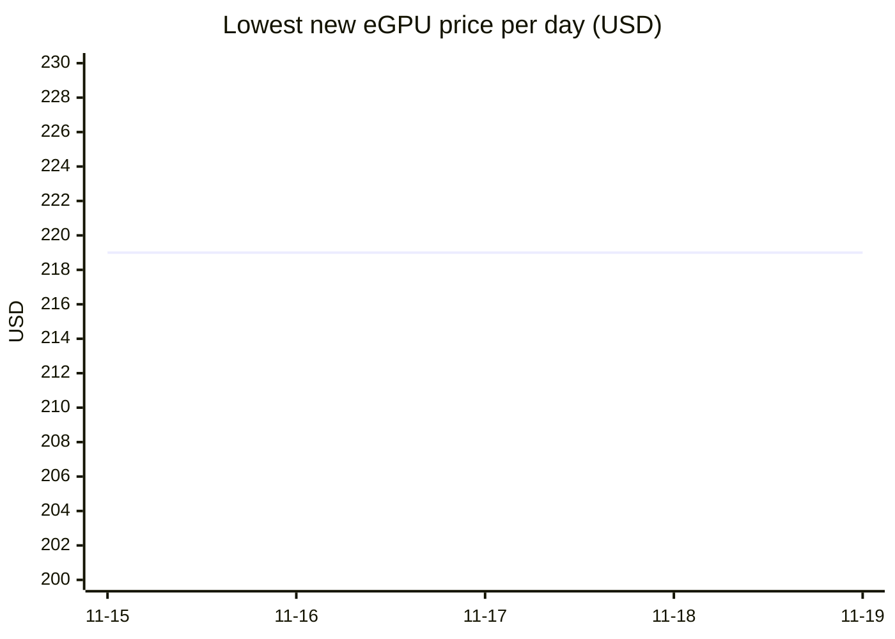
```mermaid
xychart-beta
    title "Lowest new eGPU price per day (USD)"
    x-axis ["11-15", "11-16", "11-17", "11-18", "11-19"]
    y-axis "USD" 200 --> 230
    line [219.00, 219.00, 219.00, 219.00, 219.00]
```

#### Latest price by item (new, cheapest store)

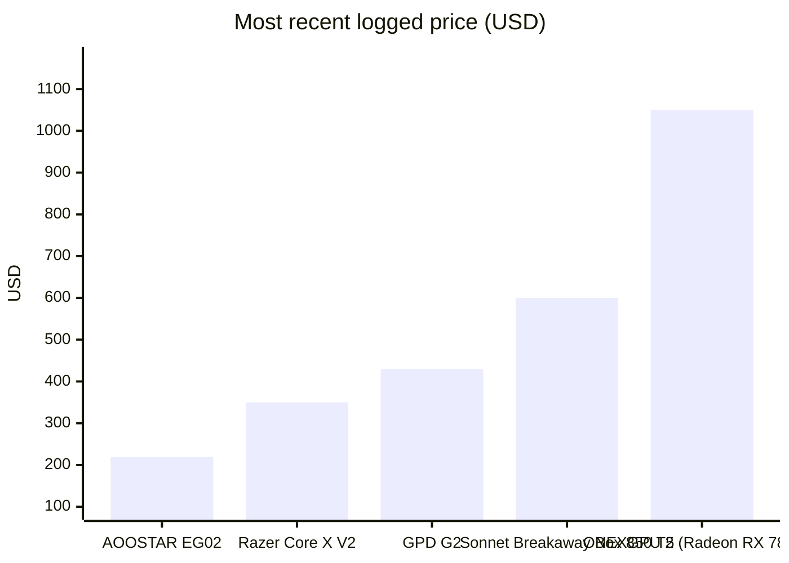
```mermaid
xychart-beta
    title "Most recent logged price (USD)"
    x-axis ["AOOSTAR EG02", "Razer Core X V2", "GPD G2", "Sonnet Breakaway Box 850 T5", "ONEXGPU 2 (Radeon RX 7800M)"]
    y-axis "USD" 90 --> 1180
    bar [219.00, 349.99, 429.99, 599.99, 1049.99]
```

#### Latest prices

| Item | Spec | Store | Condition | Price | Change | As of | Basis | Link |
|---|---|---|---|--:|--:|---|---|---|
| AOOSTAR EG02 | Enclosure, TB5, No PSU / ATX required | Amazon (third-party seller) | new | **$219.00** | — | 2026-11-19 | direct | [link](https://www.amazon.com/dp/B0G3TV5HKJ) |
| Razer Core X V2 | Enclosure, TB5, No PSU | Amazon | new | **$349.99** | — | 2026-11-19 | direct | [link](https://www.amazon.com/dp/B0FFQFDZWX) |
| GPD G2 | Enclosure, USB4, Built-in 800W | Amazon (third-party seller) | new | **$429.99** | — | 2026-11-19 | direct | [link](https://www.amazon.com/dp/B0HGPVYS21) |
| Sonnet Breakaway Box 850 T5 | Enclosure, TB5, Built-in 850W | Amazon (third-party seller) | new | **$599.99** | — | 2026-11-19 | direct | [link](https://www.amazon.com/dp/B0FX86P6T8) |
| ONEXGPU 2 (Radeon RX 7800M) | Complete eGPU, USB4, Included | Amazon (third-party seller) | new | **$1,049.99** | — | 2026-11-19 | direct | [link](https://www.amazon.com/dp/B0DNSLBSG8) |

<details>
<summary><b>eGPUs: price history</b></summary>

##### AOOSTAR EG02 — Amazon (third-party seller) (new)
Low $219.00 · High $219.00 · 5 entries

| Date | Price | Basis |
|---|--:|---|
| 2026-11-19 | [$219.00](https://www.amazon.com/dp/B0G3TV5HKJ) | direct |
| 2026-11-18 | [$219.00](https://www.amazon.com/dp/B0G3TV5HKJ) | direct |
| 2026-11-17 | [$219.00](https://www.amazon.com/dp/B0G3TV5HKJ) | direct |
| 2026-11-16 | [$219.00](https://www.amazon.com/dp/B0G3TV5HKJ) | direct |
| 2026-11-15 | [$219.00](https://www.amazon.com/dp/B0G3TV5HKJ) | direct |

##### GPD G2 — Amazon (third-party seller) (new)
Low $429.99 · High $429.99 · 2 entries

| Date | Price | Basis |
|---|--:|---|
| 2026-11-19 | [$429.99](https://www.amazon.com/dp/B0HGPVYS21) | direct |
| 2026-11-18 | [$429.99](https://www.amazon.com/dp/B0HGPVYS21) | direct |

##### ONEXGPU 2 (Radeon RX 7800M) — Amazon (third-party seller) (new)
Low $1,049.99 · High $1,049.99 · 2 entries

| Date | Price | Basis |
|---|--:|---|
| 2026-11-19 | [$1,049.99](https://www.amazon.com/dp/B0DNSLBSG8) | direct |
| 2026-11-18 | [$1,049.99](https://www.amazon.com/dp/B0DNSLBSG8) | direct |

##### Razer Core X V2 — Amazon (new)
Low $349.99 · High $349.99 · 5 entries

| Date | Price | Basis |
|---|--:|---|
| 2026-11-19 | [$349.99](https://www.amazon.com/dp/B0FFQFDZWX) | direct |
| 2026-11-18 | [$349.99](https://www.amazon.com/dp/B0FFQFDZWX) | direct |
| 2026-11-17 | [$349.99](https://www.amazon.com/dp/B0FFQFDZWX) | direct |
| 2026-11-16 | [$349.99](https://www.amazon.com/dp/B0FFQFDZWX) | direct |
| 2026-11-15 | [$349.99](https://www.amazon.com/dp/B0FFQFDZWX) | direct |

##### Sonnet Breakaway Box 850 T5 — Amazon (third-party seller) (new)
Low $599.99 · High $599.99 · 2 entries

| Date | Price | Basis |
|---|--:|---|
| 2026-11-19 | [$599.99](https://www.amazon.com/dp/B0FX86P6T8) | direct |
| 2026-11-18 | [$599.99](https://www.amazon.com/dp/B0FX86P6T8) | direct |

</details>

### MacBooks

> **Cheapest new high-memory MacBook on 2026-11-22:** MacBook Pro 14 M2 Max 96GB (96GB RAM, 512GB SSD) at **$3,299.74** (eBay) — [source](https://www.ebay.com/itm/227398467227)

#### Cheapest new high-memory MacBook price over time

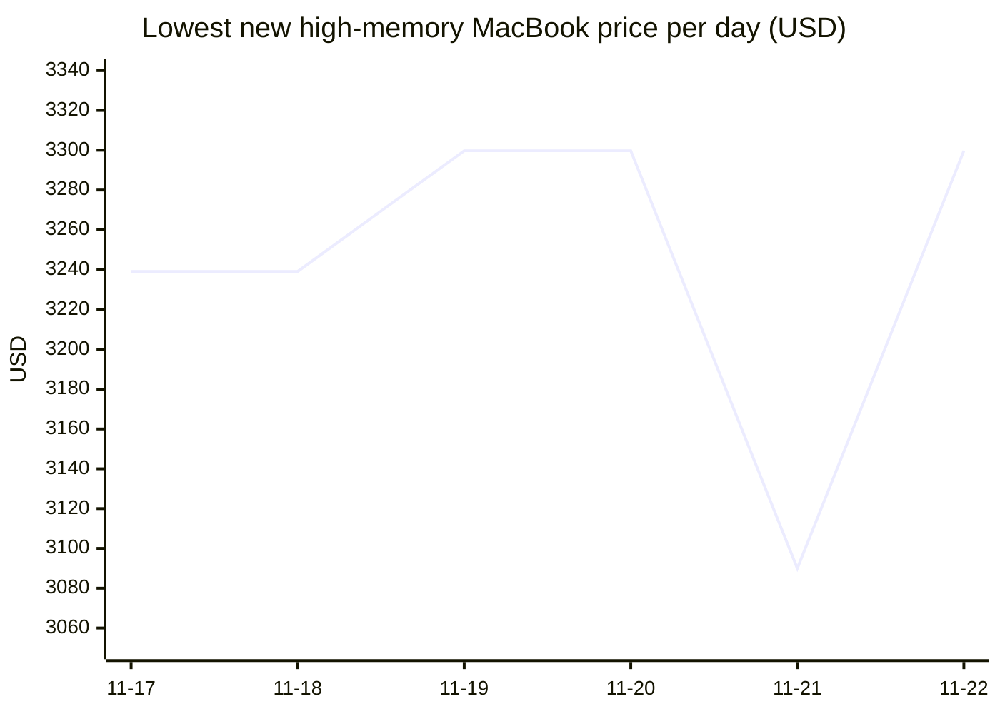
```mermaid
xychart-beta
    title "Lowest new high-memory MacBook price per day (USD)"
    x-axis ["11-17", "11-18", "11-19", "11-20", "11-21", "11-22"]
    y-axis "USD" 3050 --> 3340
    line [3239.09, 3239.10, 3299.74, 3299.74, 3089.95, 3299.74]
```

#### Latest price by item (new, cheapest store)

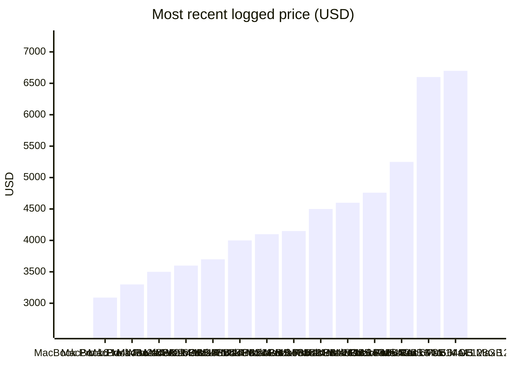
```mermaid
xychart-beta
    title "Most recent logged price (USD)"
    x-axis ["MacBook Pro 16 M4 Max 48GB", "MacBook Pro 14 M2 Max 96GB", "MacBook Pro 14 M2 Max 64GB", "MacBook Pro 14 M5 Pro 48GB", "MacBook Pro 14 M5 Pro 64GB", "MacBook Pro 14 M3 Max 64GB", "MacBook Pro 16 M5 Pro 48GB", "MacBook Pro 16 M5 Max 48GB", "MacBook Pro 14 M4 Max 64GB", "MacBook Pro 16 M5 Pro 64GB", "MacBook Pro 16 M5 Max 64GB", "MacBook Pro 14 M5 Max 64GB", "MacBook Pro 16 M5 Max 128GB", "MacBook Pro 14 M5 Max 128GB"]
    y-axis "USD" 2540 --> 7250
    bar [3089.95, 3299.74, 3500.00, 3599.00, 3699.00, 3999.99, 4099.00, 4149.00, 4499.99, 4599.00, 4759.50, 5249.00, 6600.00, 6699.00]
```

#### Latest prices

| Item | Spec | Store | Condition | Price | Change | As of | Basis | Link |
|---|---|---|---|--:|--:|---|---|---|
| MacBook Pro 16 M2 Max 64GB | 64GB RAM, 1TB SSD | eBay | used | **$1,299.00** | — | 2026-11-20 | direct | [link](https://www.ebay.com/itm/287740142475) |
| MacBook Pro 16 M2 Max 64GB | 64GB RAM, 1TB SSD | eBay | refurbished | **$1,597.06** | — | 2026-11-22 | direct | [link](https://www.ebay.com/itm/880130330092) |
| MacBook Pro 16 M1 Max 64GB | 64GB RAM, 1TB SSD | Amazon (third-party seller) | refurbished | **$1,650.00 🔥** | 🔻 $4.00 | 2026-11-22 | direct | [link](https://www.amazon.com/dp/B0CLJTSXHF) |
| MacBook Pro 14 M2 Max 64GB | 64GB RAM, 512GB SSD, 12C CPU/30C GPU | eBay | used | **$1,700.00** | — | 2026-11-22 | direct | [link](https://www.ebay.com/itm/920148309552) |
| MacBook Pro 14 M1 Max 64GB | 64GB RAM, 2TB SSD | Amazon (third-party seller) | refurbished | **$1,779.99** | new | 2026-11-17 | direct | [link](https://www.amazon.com/dp/B0F8JNXBY4) |
| MacBook Pro 16 M2 Max 96GB | 96GB RAM, 2TB SSD | eBay | used | **$2,275.00 🔥** | 🔻 $1,533.99 | 2026-11-21 | direct | [link](https://www.ebay.com/itm/227624007983) |
| MacBook Pro 14 M3 Max 64GB | 64GB RAM, 1TB SSD | eBay | refurbished | **$2,299.00** | new | 2026-11-21 | direct | [link](https://www.ebay.com/itm/306884322048) |
| MacBook Pro 16 M4 Pro 48GB | 48GB RAM, 512GB SSD | Amazon (third-party seller) | refurbished | **$2,349.99** | 🔻 $125.00 | 2026-11-22 | direct | [link](https://www.amazon.com/dp/B0DSFNC8GQ) |
| MacBook Pro 16 M2 Max 64GB | 64GB RAM, 1TB SSD | Amazon (third-party seller) | refurbished | **$2,398.00** | 🔻 $8.00 | 2026-11-22 | direct | [link](https://www.amazon.com/dp/B0FHP6C3BL) |
| MacBook Pro 16 M3 Max 64GB | 64GB RAM, 1TB SSD | eBay | used | **$2,419.99** | — | 2026-11-22 | direct | [link](https://www.ebay.com/itm/298598919121) |
| MacBook Pro 14 M3 Max 64GB | 64GB RAM, 1TB SSD | eBay | used | **$2,514.99** | — | 2026-11-22 | direct | [link](https://www.ebay.com/itm/298665135818) |
| MacBook Pro 16 M3 Max 64GB | 64GB RAM, 1TB SSD, 16C CPU/40C GPU | Amazon (third-party seller) | refurbished | **$2,949.00 🔥** | 🔻 $250.00 | 2026-11-21 | direct | [link](https://www.amazon.com/dp/B0F1Z7BR77) |
| MacBook Pro 16 M4 Max 64GB | 64GB RAM, 1TB SSD | eBay | used | **$2,984.99** | 🔻 $14.01 | 2026-11-22 | direct | [link](https://www.ebay.com/itm/227585032379) |
| MacBook Pro 16 M2 Max 96GB | 96GB RAM, 2TB SSD, 12C CPU/38C GPU | eBay | refurbished | **$2,999.99** | new | 2026-11-22 | direct | [link](https://www.ebay.com/itm/285745402948) |
| MacBook Pro 16 M5 Pro 48GB | 48GB RAM, 1TB SSD, 18C CPU/20C GPU | Apple (Certified Refurbished) | refurbished | **$3,059.00** | — | 2026-11-22 | direct | [link](https://www.apple.com/shop/product/fgec4ll/a/Refurbished-16-inch-MacBook-Pro-Apple-M5-Pro-chip-with-18%E2%80%91Core-CPU-and-20%E2%80%91Core-GPU-Space-Black) |
| MacBook Pro 14 M4 Max 64GB | 64GB RAM, 1TB SSD | eBay | used | **$3,079.99** | — | 2026-11-22 | direct | [link](https://www.ebay.com/itm/298636560028) |
| MacBook Pro 16 M4 Max 48GB | 48GB RAM, 1TB SSD, 16C CPU/40C GPU | Amazon (third-party seller) | new | **$3,089.95** | new | 2026-11-21 | direct | [link](https://www.amazon.com/dp/B0GSHHBP4M) |
| MacBook Pro 16 M4 Max 64GB | 64GB RAM, 1TB SSD | eBay | refurbished | **$3,097.00** | new | 2026-11-18 | direct | [link](https://www.ebay.com/itm/366748286165) |
| MacBook Pro 14 M4 Pro 48GB | 48GB RAM, 2TB SSD, 14C CPU/20C GPU | Apple (Certified Refurbished) | refurbished | **$3,269.00** | — | 2026-11-22 | direct | [link](https://www.apple.com/shop/product/g1ff9ll/a/Refurbished-14-inch-MacBook-Pro-Apple-M4-Pro-Chip-with-14%E2%80%91Core-CPU-and-20%E2%80%91Core-GPU-Nano-texture-display-Space-Black) |
| MacBook Pro 16 M4 Max 48GB | 48GB RAM, 1TB SSD | Amazon (third-party seller) | refurbished | **$3,272.00** | 🔺 $342.01 | 2026-11-19 | direct | [link](https://www.amazon.com/dp/B0DN25LGK8) |
| MacBook Pro 14 M2 Max 96GB | 96GB RAM, 512GB SSD | eBay | new | **$3,299.74** | — | 2026-11-22 | direct | [link](https://www.ebay.com/itm/227398467227) |
| MacBook Pro 16 M4 Max 64GB | 64GB RAM, 1TB SSD | Amazon (third-party seller) | refurbished | **$3,299.95** | — | 2026-11-22 | direct | [link](https://www.amazon.com/dp/B0F1KYQBXN) |
| MacBook Pro 14 M5 Pro 48GB | 48GB RAM, 2TB SSD, 18C CPU/20C GPU | Apple (Certified Refurbished) | refurbished | **$3,359.00** | 🔺 $180.00 | 2026-11-22 | direct | [link](https://www.apple.com/shop/product/g1mm3ll/a/Refurbished-14-inch-MacBook-Pro-Apple-M5-Pro-chip-with-18%E2%80%91Core-CPU-and-20%E2%80%91Core-GPU-Nano-texture-display-Space-Black) |
| MacBook Pro 14 M2 Max 96GB | 96GB RAM, 8TB SSD | eBay | used | **$3,499.99** | — | 2026-11-22 | direct | [link](https://www.ebay.com/itm/960183817160) |
| MacBook Pro 14 M2 Max 64GB | 64GB RAM, 2TB SSD | eBay | new | **$3,500.00** | — | 2026-11-22 | direct | [link](https://www.ebay.com/itm/375011618605) |
| MacBook Pro 16 M5 Pro 64GB | 64GB RAM, 1TB SSD, 18C CPU/20C GPU | Apple (Certified Refurbished) | refurbished | **$3,529.00** | new | 2026-11-19 | direct | [link](https://www.apple.com/shop/product/g1n07ll/a/Refurbished-16-inch-MacBook-Pro-Apple-M5-Pro-chip-with-18%E2%80%91Core-CPU-and-20%E2%80%91Core-GPU-Nano-texture-display-Space-Black) |
| MacBook Pro 14 M5 Pro 48GB | 48GB RAM, 1TB SSD, 15C CPU/16C GPU | Amazon (third-party seller) | new | **$3,599.00** | — | 2026-11-22 | direct | [link](https://www.amazon.com/dp/B0H46QQ5KM) |
| MacBook Pro 14 M5 Pro 64GB | 64GB RAM, 1TB SSD, 18C CPU/20C GPU | Amazon (third-party seller) | new | **$3,699.00** | — | 2026-11-22 | direct | [link](https://www.amazon.com/dp/B0GYZKZ2WX) |
| MacBook Pro 14 M3 Max 128GB | 128GB RAM, 1TB SSD | eBay | used | **$3,849.00** | — | 2026-11-22 | direct | [link](https://www.ebay.com/itm/960188540623) |
| MacBook Pro 16 M3 Max 96GB | 96GB RAM, 1TB SSD | eBay | used | **$3,990.00** | — | 2026-11-22 | direct | [link](https://www.ebay.com/itm/277060197180) |
| MacBook Pro 16 M5 Max 64GB | 64GB RAM, 2TB SSD | eBay | used | **$3,999.00** | — | 2026-11-19 | direct | [link](https://www.ebay.com/itm/198803468812) |
| MacBook Pro 14 M3 Max 64GB | 64GB RAM, 2TB SSD, 16C CPU/40C GPU | eBay | new | **$3,999.99 🔥** | 🔻 $100.00 | 2026-11-22 | direct | [link](https://www.ebay.com/itm/236127680110) |
| MacBook Pro 16 M5 Pro 48GB | 48GB RAM, 2TB SSD, 18C CPU/20C GPU | Amazon (third-party seller) | new | **$4,099.00** | — | 2026-11-22 | direct | [link](https://www.amazon.com/dp/B0GV5ZCZ44) |
| MacBook Pro 14 M5 Max 48GB | 48GB RAM, 2TB SSD, 18C CPU/40C GPU | Apple (Certified Refurbished) | refurbished | **$4,119.00** | — | 2026-11-21 | direct | [link](https://www.apple.com/shop/product/g1mkfll/a/Refurbished-14-inch-MacBook-Pro-Apple-M5-Max-chip-with-18%E2%80%91Core-CPU-and-40%E2%80%91Core-GPU-Nano-texture-display-Silver) |
| MacBook Pro 16 M5 Max 48GB | 48GB RAM, 2TB SSD, 18C CPU/40C GPU | Amazon | new | **$4,149.00** | 🔻 $350.00 | 2026-11-18 | direct | [link](https://www.amazon.com/dp/B0GR1G6V6H) |
| MacBook Pro 14 M4 Max 128GB | 128GB RAM, 1TB SSD | eBay | used | **$4,199.00** | — | 2026-11-22 | direct | [link](https://www.ebay.com/itm/960175867500) |
| MacBook Pro 16 M5 Max 48GB | 48GB RAM, 2TB SSD, 18C CPU/40C GPU | Apple (Certified Refurbished) | refurbished | **$4,249.00** | — | 2026-11-22 | direct | [link](https://www.apple.com/shop/product/fge94ll/a/Refurbished-16-inch-MacBook-Pro-Apple-M5-Max-chip-with-18%E2%80%91Core-CPU-and-40%E2%80%91Core-GPU-Silver) |
| MacBook Pro 16 M5 Max 64GB | 64GB RAM, 2TB SSD | eBay | refurbished | **$4,299.95** | — | 2026-11-22 | direct | [link](https://www.ebay.com/itm/147371684774) |
| MacBook Pro 16 M5 Max 48GB | 48GB RAM, 2TB SSD, 18C CPU/40C GPU | Amazon (third-party seller) | new | **$4,496.50** | new | 2026-11-18 | direct | [link](https://www.amazon.com/dp/B0GR1G6V6H) |
| MacBook Pro 16 M3 Max 128GB | 128GB RAM, 2TB SSD, 16C CPU/40C GPU | eBay | used | **$4,499.00** | — | 2026-11-19 | direct | [link](https://www.ebay.com/itm/940099895248) |
| MacBook Pro 14 M4 Max 64GB | 64GB RAM, 4TB SSD | eBay | new | **$4,499.99** | — | 2026-11-22 | direct | [link](https://www.ebay.com/itm/820343708882) |
| MacBook Pro 16 M5 Pro 64GB | 64GB RAM, 1TB SSD, 18C CPU/20C GPU | Amazon (third-party seller) | new | **$4,599.00** | — | 2026-11-22 | direct | [link](https://www.amazon.com/dp/B0H7Z68CLL) |
| MacBook Pro 14 M5 Max 64GB | 64GB RAM, 2TB SSD | eBay | refurbished | **$4,699.99** | — | 2026-11-22 | direct | [link](https://www.ebay.com/itm/900086415863) |
| MacBook Pro 16 M5 Max 64GB | 64GB RAM, 2TB SSD, 18C CPU/40C GPU | Apple (Certified Refurbished) | refurbished | **$4,719.00** | 🔺 $130.00 | 2026-11-21 | direct | [link](https://www.apple.com/shop/product/g1n24ll/a/Refurbished-16-inch-MacBook-Pro-Apple-M5-Max-chip-with-18%E2%80%91Core-CPU-and-40%E2%80%91Core-GPU-Nano-texture-display-Space-Black) |
| MacBook Pro 16 M5 Max 64GB | 64GB RAM, 2TB SSD | eBay | new | **$4,759.50** | — | 2026-11-22 | direct | [link](https://www.ebay.com/itm/127952390214) |
| MacBook Pro 14 M5 Max 64GB | 64GB RAM, 4TB SSD, 18C CPU/40C GPU | Apple (Certified Refurbished) | refurbished | **$5,179.00** | new | 2026-11-19 | direct | [link](https://www.apple.com/shop/product/g1mnmll/a/Refurbished-14-inch-MacBook-Pro-Apple-M5-Max-chip-with-18%E2%80%91Core-CPU-and-40%E2%80%91Core-GPU-Space-Black) |
| MacBook Pro 14 M5 Max 64GB | 64GB RAM, 18C CPU/40C GPU | Amazon (third-party seller) | new | **$5,249.00** | 🔺 $150.00 | 2026-11-22 | direct | [link](https://www.amazon.com/dp/B0H5JNFY5W) |
| MacBook Pro 16 M3 Max 128GB | 128GB RAM, 8TB SSD, 16C CPU/40C GPU | eBay | refurbished | **$5,279.99** | — | 2026-11-22 | direct | [link](https://www.ebay.com/itm/287021044469) |
| MacBook Pro 14 M5 Max 128GB | 128GB RAM, 2TB SSD | eBay | used | **$5,499.99** | — | 2026-11-22 | direct | [link](https://www.ebay.com/itm/366826119274) |
| MacBook Pro 16 M4 Max 128GB | 128GB RAM, 4TB SSD | eBay | used | **$5,699.99** | 🔻 $100.00 | 2026-11-22 | direct | [link](https://www.ebay.com/itm/327467414019) |
| MacBook Pro 16 M5 Max 64GB | 64GB RAM, 2TB SSD | Amazon (third-party seller) | new | **$5,799.99** | new | 2026-11-22 | direct | [link](https://www.amazon.com/dp/B0HS24RGVZ) |
| MacBook Pro 16 M5 Max 128GB | 128GB RAM, 2TB SSD | eBay | used | **$5,900.00** | — | 2026-11-22 | direct | [link](https://www.ebay.com/itm/206622860547) |
| MacBook Pro 14 M5 Max 64GB | 64GB RAM, 2TB SSD | eBay | new | **$5,999.99** | — | 2026-11-22 | direct | [link](https://www.ebay.com/itm/307212063187) |
| MacBook Pro 16 M5 Max 128GB | 128GB RAM, 2TB SSD | eBay | new | **$6,600.00** | — | 2026-11-22 | direct | [link](https://www.ebay.com/itm/227610055525) |
| MacBook Pro 14 M5 Max 128GB | 128GB RAM, 2TB SSD, 18C CPU/40C GPU | Amazon (third-party seller) | new | **$6,699.00** | — | 2026-11-18 | direct | [link](https://www.amazon.com/dp/B0GZ4SQXGD) |
| MacBook Pro 14 M5 Max 128GB | 128GB RAM, 2TB SSD | eBay | new | **$6,899.00** | — | 2026-11-22 | direct | [link](https://www.ebay.com/itm/940053163792) |
| MacBook Pro 16 M5 Max 128GB | 128GB RAM, 2TB SSD, 18C CPU/40C GPU | Amazon (third-party seller) | new | **$7,699.99** | — | 2026-11-22 | direct | [link](https://www.amazon.com/dp/B0H4HYD6PX) |
| MacBook Pro 14 M5 Max 128GB | 128GB RAM, 8TB SSD, 18C CPU/40C GPU | Apple (Certified Refurbished) | refurbished | **$8,369.00** | new | 2026-11-19 | direct | [link](https://www.apple.com/shop/product/g1mk9ll/a/Refurbished-14-inch-MacBook-Pro-Apple-M5-Max-chip-with-18%E2%80%91Core-CPU-and-40%E2%80%91Core-GPU-Nano-texture-display-Silver) |
| MacBook Pro 16 M5 Max 128GB | 128GB RAM, 8TB SSD, 18C CPU/40C GPU | Apple (Certified Refurbished) | refurbished | **$8,499.00** | new | 2026-11-19 | direct | [link](https://www.apple.com/shop/product/g1mygll/a/Refurbished-16-inch-MacBook-Pro-Apple-M5-Max-chip-with-18%E2%80%91Core-CPU-and-40%E2%80%91Core-GPU-Silver) |

<details>
<summary><b>MacBooks: price history</b></summary>

##### MacBook Pro 14 M1 Max 64GB — Amazon (third-party seller) (refurbished)
Low $1,779.99 · High $1,779.99 · 1 entry

| Date | Price | Basis |
|---|--:|---|
| 2026-11-17 | [$1,779.99](https://www.amazon.com/dp/B0F8JNXBY4) | direct |

##### MacBook Pro 14 M2 Max 64GB — eBay (new)
Low $3,500.00 · High $3,500.00 · 5 entries

| Date | Price | Basis |
|---|--:|---|
| 2026-11-22 | [$3,500.00](https://www.ebay.com/itm/375011618605) | direct |
| 2026-11-21 | [$3,500.00](https://www.ebay.com/itm/375011618605) | direct |
| 2026-11-20 | [$3,500.00](https://www.ebay.com/itm/375011618605) | direct |
| 2026-11-19 | [$3,500.00](https://www.ebay.com/itm/375011618605) | direct |
| 2026-11-18 | [$3,500.00](https://www.ebay.com/itm/375011618605) | direct |

##### MacBook Pro 14 M2 Max 64GB — eBay (used)
Low $1,649.99 · High $1,834.99 · 5 entries

| Date | Price | Basis |
|---|--:|---|
| 2026-11-22 | [$1,700.00](https://www.ebay.com/itm/920148309552) | direct |
| 2026-11-21 | [$1,700.00](https://www.ebay.com/itm/920148309552) | direct |
| 2026-11-20 | [$1,834.99](https://www.ebay.com/itm/298656791108) | direct |
| 2026-11-19 | [$1,649.99](https://www.ebay.com/itm/307289566549) | direct |
| 2026-11-18 | [$1,834.99](https://www.ebay.com/itm/298656791108) | direct |

##### MacBook Pro 14 M2 Max 96GB — eBay (new)
Low $3,299.74 · High $3,299.74 · 5 entries

| Date | Price | Basis |
|---|--:|---|
| 2026-11-22 | [$3,299.74](https://www.ebay.com/itm/227398467227) | direct |
| 2026-11-21 | [$3,299.74](https://www.ebay.com/itm/227398467227) | direct |
| 2026-11-20 | [$3,299.74](https://www.ebay.com/itm/227398467227) | direct |
| 2026-11-19 | [$3,299.74](https://www.ebay.com/itm/227398467227) | direct |
| 2026-11-18 | [$3,299.74](https://www.ebay.com/itm/227398467227) | direct |

##### MacBook Pro 14 M2 Max 96GB — eBay (used)
Low $3,499.99 · High $3,499.99 · 5 entries

| Date | Price | Basis |
|---|--:|---|
| 2026-11-22 | [$3,499.99](https://www.ebay.com/itm/960183817160) | direct |
| 2026-11-21 | [$3,499.99](https://www.ebay.com/itm/960183817160) | direct |
| 2026-11-20 | [$3,499.99](https://www.ebay.com/itm/960183817160) | direct |
| 2026-11-19 | [$3,499.99](https://www.ebay.com/itm/960183817160) | direct |
| 2026-11-18 | [$3,499.99](https://www.ebay.com/itm/960183817160) | direct |

##### MacBook Pro 14 M3 Max 128GB — eBay (used)
Low $3,849.00 · High $3,849.00 · 5 entries

| Date | Price | Basis |
|---|--:|---|
| 2026-11-22 | [$3,849.00](https://www.ebay.com/itm/960188540623) | direct |
| 2026-11-21 | [$3,849.00](https://www.ebay.com/itm/960188540623) | direct |
| 2026-11-20 | [$3,849.00](https://www.ebay.com/itm/960188540623) | direct |
| 2026-11-19 | [$3,849.00](https://www.ebay.com/itm/960188540623) | direct |
| 2026-11-18 | [$3,849.00](https://www.ebay.com/itm/960188540623) | direct |

##### MacBook Pro 14 M3 Max 64GB — eBay (new)
Low $3,999.99 · High $4,299.99 · 5 entries

| Date | Price | Basis |
|---|--:|---|
| 2026-11-22 | [$3,999.99](https://www.ebay.com/itm/236127680110) | direct |
| 2026-11-21 | [$4,099.99](https://www.ebay.com/itm/236127680110) | direct |
| 2026-11-20 | [$4,099.99](https://www.ebay.com/itm/236127680110) | direct |
| 2026-11-19 | [$4,199.99](https://www.ebay.com/itm/236127680110) | direct |
| 2026-11-18 | [$4,299.99](https://www.ebay.com/itm/236127680110) | direct |

##### MacBook Pro 14 M3 Max 64GB — eBay (refurbished)
Low $2,299.00 · High $2,299.00 · 1 entry

| Date | Price | Basis |
|---|--:|---|
| 2026-11-21 | [$2,299.00](https://www.ebay.com/itm/306884322048) | direct |

##### MacBook Pro 14 M3 Max 64GB — eBay (used)
Low $2,514.99 · High $2,514.99 · 4 entries

| Date | Price | Basis |
|---|--:|---|
| 2026-11-22 | [$2,514.99](https://www.ebay.com/itm/298665135818) | direct |
| 2026-11-20 | [$2,514.99](https://www.ebay.com/itm/298665135818) | direct |
| 2026-11-19 | [$2,514.99](https://www.ebay.com/itm/298665135818) | direct |
| 2026-11-18 | [$2,514.99](https://www.ebay.com/itm/298665135818) | direct |

##### MacBook Pro 14 M4 Max 128GB — eBay (used)
Low $4,199.00 · High $4,449.00 · 5 entries

| Date | Price | Basis |
|---|--:|---|
| 2026-11-22 | [$4,199.00](https://www.ebay.com/itm/960175867500) | direct |
| 2026-11-21 | [$4,199.00](https://www.ebay.com/itm/960175867500) | direct |
| 2026-11-20 | [$4,199.00](https://www.ebay.com/itm/960175867500) | direct |
| 2026-11-19 | [$4,449.00](https://www.ebay.com/itm/960175867500) | direct |
| 2026-11-18 | [$4,449.00](https://www.ebay.com/itm/960175867500) | direct |

##### MacBook Pro 14 M4 Max 64GB — eBay (new)
Low $4,499.99 · High $4,499.99 · 5 entries

| Date | Price | Basis |
|---|--:|---|
| 2026-11-22 | [$4,499.99](https://www.ebay.com/itm/820343708882) | direct |
| 2026-11-21 | [$4,499.99](https://www.ebay.com/itm/820343708882) | direct |
| 2026-11-20 | [$4,499.99](https://www.ebay.com/itm/820343708882) | direct |
| 2026-11-19 | [$4,499.99](https://www.ebay.com/itm/820343708882) | direct |
| 2026-11-18 | [$4,499.99](https://www.ebay.com/itm/820343708882) | direct |

##### MacBook Pro 14 M4 Max 64GB — eBay (used)
Low $3,079.99 · High $3,079.99 · 5 entries

| Date | Price | Basis |
|---|--:|---|
| 2026-11-22 | [$3,079.99](https://www.ebay.com/itm/298636560028) | direct |
| 2026-11-21 | [$3,079.99](https://www.ebay.com/itm/298636560028) | direct |
| 2026-11-20 | [$3,079.99](https://www.ebay.com/itm/298636560028) | direct |
| 2026-11-19 | [$3,079.99](https://www.ebay.com/itm/298636560028) | direct |
| 2026-11-18 | [$3,079.99](https://www.ebay.com/itm/298636560028) | direct |

##### MacBook Pro 14 M4 Pro 48GB — Apple (Certified Refurbished) (refurbished)
Low $3,269.00 · High $3,269.00 · 6 entries

| Date | Price | Basis |
|---|--:|---|
| 2026-11-22 | [$3,269.00](https://www.apple.com/shop/product/g1ff9ll/a/Refurbished-14-inch-MacBook-Pro-Apple-M4-Pro-Chip-with-14%E2%80%91Core-CPU-and-20%E2%80%91Core-GPU-Nano-texture-display-Space-Black) | direct |
| 2026-11-21 | [$3,269.00](https://www.apple.com/shop/product/g1ff9ll/a/Refurbished-14-inch-MacBook-Pro-Apple-M4-Pro-Chip-with-14%E2%80%91Core-CPU-and-20%E2%80%91Core-GPU-Nano-texture-display-Space-Black) | direct |
| 2026-11-20 | [$3,269.00](https://www.apple.com/shop/product/g1ff9ll/a/Refurbished-14-inch-MacBook-Pro-Apple-M4-Pro-Chip-with-14%E2%80%91Core-CPU-and-20%E2%80%91Core-GPU-Nano-texture-display-Space-Black) | direct |
| 2026-11-19 | [$3,269.00](https://www.apple.com/shop/product/g1ff9ll/a/Refurbished-14-inch-MacBook-Pro-Apple-M4-Pro-Chip-with-14%E2%80%91Core-CPU-and-20%E2%80%91Core-GPU-Nano-texture-display-Space-Black) | direct |
| 2026-11-18 | [$3,269.00](https://www.apple.com/shop/product/g1ff9ll/a/Refurbished-14-inch-MacBook-Pro-Apple-M4-Pro-Chip-with-14%E2%80%91Core-CPU-and-20%E2%80%91Core-GPU-Nano-texture-display-Space-Black) | direct |
| 2026-11-17 | [$3,269.00](https://www.apple.com/shop/product/g1ff9ll/a/Refurbished-14-inch-MacBook-Pro-Apple-M4-Pro-Chip-with-14%E2%80%91Core-CPU-and-20%E2%80%91Core-GPU-Nano-texture-display-Space-Black) | direct |

##### MacBook Pro 14 M5 Max 128GB — Amazon (third-party seller) (new)
Low $6,699.00 · High $6,699.00 · 2 entries

| Date | Price | Basis |
|---|--:|---|
| 2026-11-18 | [$6,699.00](https://www.amazon.com/dp/B0GZ4SQXGD) | direct |
| 2026-11-17 | [$6,699.00](https://www.amazon.com/dp/B0GZ4SQXGD) | direct |

##### MacBook Pro 14 M5 Max 128GB — Apple (Certified Refurbished) (refurbished)
Low $8,369.00 · High $8,369.00 · 1 entry

| Date | Price | Basis |
|---|--:|---|
| 2026-11-19 | [$8,369.00](https://www.apple.com/shop/product/g1mk9ll/a/Refurbished-14-inch-MacBook-Pro-Apple-M5-Max-chip-with-18%E2%80%91Core-CPU-and-40%E2%80%91Core-GPU-Nano-texture-display-Silver) | direct |

##### MacBook Pro 14 M5 Max 128GB — eBay (new)
Low $6,899.00 · High $6,899.00 · 5 entries

| Date | Price | Basis |
|---|--:|---|
| 2026-11-22 | [$6,899.00](https://www.ebay.com/itm/940053163792) | direct |
| 2026-11-21 | [$6,899.00](https://www.ebay.com/itm/940053163792) | direct |
| 2026-11-20 | [$6,899.00](https://www.ebay.com/itm/940053163792) | direct |
| 2026-11-19 | [$6,899.00](https://www.ebay.com/itm/940053163792) | direct |
| 2026-11-18 | [$6,899.00](https://www.ebay.com/itm/940053163792) | direct |

##### MacBook Pro 14 M5 Max 128GB — eBay (used)
Low $5,499.99 · High $5,899.00 · 5 entries

| Date | Price | Basis |
|---|--:|---|
| 2026-11-22 | [$5,499.99](https://www.ebay.com/itm/366826119274) | direct |
| 2026-11-21 | [$5,499.99](https://www.ebay.com/itm/366826119274) | direct |
| 2026-11-20 | [$5,799.00](https://www.ebay.com/itm/880023866326) | direct |
| 2026-11-19 | [$5,799.00](https://www.ebay.com/itm/880023866326) | direct |
| 2026-11-18 | [$5,899.00](https://www.ebay.com/itm/880023866326) | direct |

##### MacBook Pro 14 M5 Max 48GB — Apple (Certified Refurbished) (refurbished)
Low $4,119.00 · High $4,119.00 · 3 entries

| Date | Price | Basis |
|---|--:|---|
| 2026-11-21 | [$4,119.00](https://www.apple.com/shop/product/g1mkfll/a/Refurbished-14-inch-MacBook-Pro-Apple-M5-Max-chip-with-18%E2%80%91Core-CPU-and-40%E2%80%91Core-GPU-Nano-texture-display-Silver) | direct |
| 2026-11-20 | [$4,119.00](https://www.apple.com/shop/product/g1mnfll/a/Refurbished-14-inch-MacBook-Pro-Apple-M5-Max-chip-with-18%E2%80%91Core-CPU-and-40%E2%80%91Core-GPU-Nano-texture-display-Space-Black) | direct |
| 2026-11-19 | [$4,119.00](https://www.apple.com/shop/product/g1mkfll/a/Refurbished-14-inch-MacBook-Pro-Apple-M5-Max-chip-with-18%E2%80%91Core-CPU-and-40%E2%80%91Core-GPU-Nano-texture-display-Silver) | direct |

##### MacBook Pro 14 M5 Max 64GB — Amazon (third-party seller) (new)
Low $5,099.00 · High $5,249.00 · 6 entries

| Date | Price | Basis |
|---|--:|---|
| 2026-11-22 | [$5,249.00](https://www.amazon.com/dp/B0H5JNFY5W) | direct |
| 2026-11-21 | [$5,099.00](https://www.amazon.com/dp/B0GWS9J8KY) | direct |
| 2026-11-20 | [$5,099.00](https://www.amazon.com/dp/B0GWS9J8KY) | direct |
| 2026-11-19 | [$5,099.00](https://www.amazon.com/dp/B0GWS9J8KY) | direct |
| 2026-11-18 | [$5,099.00](https://www.amazon.com/dp/B0GWS9J8KY) | direct |
| 2026-11-17 | [$5,099.00](https://www.amazon.com/dp/B0GWS9J8KY) | direct |

##### MacBook Pro 14 M5 Max 64GB — Apple (Certified Refurbished) (refurbished)
Low $5,179.00 · High $5,179.00 · 1 entry

| Date | Price | Basis |
|---|--:|---|
| 2026-11-19 | [$5,179.00](https://www.apple.com/shop/product/g1mnmll/a/Refurbished-14-inch-MacBook-Pro-Apple-M5-Max-chip-with-18%E2%80%91Core-CPU-and-40%E2%80%91Core-GPU-Space-Black) | direct |

##### MacBook Pro 14 M5 Max 64GB — eBay (new)
Low $5,999.99 · High $5,999.99 · 5 entries

| Date | Price | Basis |
|---|--:|---|
| 2026-11-22 | [$5,999.99](https://www.ebay.com/itm/307212063187) | direct |
| 2026-11-21 | [$5,999.99](https://www.ebay.com/itm/307212063187) | direct |
| 2026-11-20 | [$5,999.99](https://www.ebay.com/itm/307212063187) | direct |
| 2026-11-19 | [$5,999.99](https://www.ebay.com/itm/307212063187) | direct |
| 2026-11-18 | [$5,999.99](https://www.ebay.com/itm/307212063187) | direct |

##### MacBook Pro 14 M5 Max 64GB — eBay (refurbished)
Low $4,699.99 · High $4,699.99 · 5 entries

| Date | Price | Basis |
|---|--:|---|
| 2026-11-22 | [$4,699.99](https://www.ebay.com/itm/900086415863) | direct |
| 2026-11-21 | [$4,699.99](https://www.ebay.com/itm/900086415863) | direct |
| 2026-11-20 | [$4,699.99](https://www.ebay.com/itm/900086415863) | direct |
| 2026-11-19 | [$4,699.99](https://www.ebay.com/itm/900086415863) | direct |
| 2026-11-18 | [$4,699.99](https://www.ebay.com/itm/900086415863) | direct |

##### MacBook Pro 14 M5 Pro 48GB — Amazon (third-party seller) (new)
Low $3,239.09 · High $3,599.00 · 6 entries

| Date | Price | Basis |
|---|--:|---|
| 2026-11-22 | [$3,599.00](https://www.amazon.com/dp/B0H46QQ5KM) | direct |
| 2026-11-21 | [$3,599.00](https://www.amazon.com/dp/B0H46QQ5KM) | direct |
| 2026-11-20 | [$3,599.00](https://www.amazon.com/dp/B0H46QQ5KM) | direct |
| 2026-11-19 | [$3,599.00](https://www.amazon.com/dp/B0H46QQ5KM) | direct |
| 2026-11-18 | [$3,239.10](https://www.amazon.com/dp/B0H4FDN7Y4) | direct |
| 2026-11-17 | [$3,239.09](https://www.amazon.com/dp/B0H46QQ5KM) | direct |

##### MacBook Pro 14 M5 Pro 48GB — Apple (Certified Refurbished) (refurbished)
Low $2,629.00 · High $3,359.00 · 5 entries

| Date | Price | Basis |
|---|--:|---|
| 2026-11-22 | [$3,359.00](https://www.apple.com/shop/product/g1mm3ll/a/Refurbished-14-inch-MacBook-Pro-Apple-M5-Pro-chip-with-18%E2%80%91Core-CPU-and-20%E2%80%91Core-GPU-Nano-texture-display-Space-Black) | direct |
| 2026-11-21 | [$3,179.00](https://www.apple.com/shop/product/g1ml1ll/a/Refurbished-14-inch-MacBook-Pro-Apple-M5-Pro-chip-with-15%E2%80%91Core-CPU-and-16%E2%80%91Core-GPU-Nano-texture-display-Space-Black) | direct |
| 2026-11-20 | [$2,629.00](https://www.apple.com/shop/product/g1mhell/a/Refurbished-14-inch-MacBook-Pro-Apple-M5-Pro-chip-with-15%E2%80%91Core-CPU-and-16%E2%80%91Core-GPU-Silver) | direct |
| 2026-11-19 | [$2,629.00](https://www.apple.com/shop/product/g1mhell/a/Refurbished-14-inch-MacBook-Pro-Apple-M5-Pro-chip-with-15%E2%80%91Core-CPU-and-16%E2%80%91Core-GPU-Silver) | direct |
| 2026-11-18 | [$3,229.00](https://www.apple.com/shop/product/g1mm2ll/a/Refurbished-14-inch-MacBook-Pro-Apple-M5-Pro-chip-with-18%E2%80%91Core-CPU-and-20%E2%80%91Core-GPU-Space-Black) | direct |

##### MacBook Pro 14 M5 Pro 64GB — Amazon (third-party seller) (new)
Low $3,699.00 · High $3,699.00 · 6 entries

| Date | Price | Basis |
|---|--:|---|
| 2026-11-22 | [$3,699.00](https://www.amazon.com/dp/B0GYZKZ2WX) | direct |
| 2026-11-21 | [$3,699.00](https://www.amazon.com/dp/B0GYZKZ2WX) | direct |
| 2026-11-20 | [$3,699.00](https://www.amazon.com/dp/B0GYZKZ2WX) | direct |
| 2026-11-19 | [$3,699.00](https://www.amazon.com/dp/B0GYZKZ2WX) | direct |
| 2026-11-18 | [$3,699.00](https://www.amazon.com/dp/B0GYZKZ2WX) | direct |
| 2026-11-17 | [$3,699.00](https://www.amazon.com/dp/B0GYZKZ2WX) | direct |

##### MacBook Pro 16 M1 Max 64GB — Amazon (third-party seller) (refurbished)
Low $1,650.00 · High $1,654.00 · 6 entries

| Date | Price | Basis |
|---|--:|---|
| 2026-11-22 | [$1,650.00](https://www.amazon.com/dp/B0CLJTSXHF) | direct |
| 2026-11-21 | [$1,654.00](https://www.amazon.com/dp/B0CLJTSXHF) | direct |
| 2026-11-20 | [$1,654.00](https://www.amazon.com/dp/B0CLJTSXHF) | direct |
| 2026-11-19 | [$1,654.00](https://www.amazon.com/dp/B0CLJTSXHF) | direct |
| 2026-11-18 | [$1,654.00](https://www.amazon.com/dp/B0CLJTSXHF) | direct |
| 2026-11-17 | [$1,654.00](https://www.amazon.com/dp/B0CLJTSXHF) | direct |

##### MacBook Pro 16 M2 Max 64GB — Amazon (third-party seller) (refurbished)
Low $2,281.63 · High $2,488.80 · 5 entries

| Date | Price | Basis |
|---|--:|---|
| 2026-11-22 | [$2,398.00](https://www.amazon.com/dp/B0FHP6C3BL) | direct |
| 2026-11-21 | [$2,406.00](https://www.amazon.com/dp/B0FHP6C3BL) | direct |
| 2026-11-20 | [$2,281.63](https://www.amazon.com/dp/B0FHP6C3BL) | direct |
| 2026-11-18 | [$2,488.80](https://www.amazon.com/dp/B0FHP6C3BL) | direct |
| 2026-11-17 | [$2,488.80](https://www.amazon.com/dp/B0FHP6C3BL) | direct |

##### MacBook Pro 16 M2 Max 64GB — eBay (refurbished)
Low $1,597.06 · High $1,597.06 · 2 entries

| Date | Price | Basis |
|---|--:|---|
| 2026-11-22 | [$1,597.06](https://www.ebay.com/itm/880130330092) | direct |
| 2026-11-21 | [$1,597.06](https://www.ebay.com/itm/880130330092) | direct |

##### MacBook Pro 16 M2 Max 64GB — eBay (used)
Low $1,299.00 · High $1,750.00 · 3 entries

| Date | Price | Basis |
|---|--:|---|
| 2026-11-20 | [$1,299.00](https://www.ebay.com/itm/287740142475) | direct |
| 2026-11-19 | [$1,299.00](https://www.ebay.com/itm/287740142475) | direct |
| 2026-11-18 | [$1,750.00](https://www.ebay.com/itm/227602714110) | direct |

##### MacBook Pro 16 M2 Max 96GB — eBay (refurbished)
Low $2,999.99 · High $2,999.99 · 1 entry

| Date | Price | Basis |
|---|--:|---|
| 2026-11-22 | [$2,999.99](https://www.ebay.com/itm/285745402948) | direct |

##### MacBook Pro 16 M2 Max 96GB — eBay (used)
Low $2,275.00 · High $3,808.99 · 4 entries

| Date | Price | Basis |
|---|--:|---|
| 2026-11-21 | [$2,275.00](https://www.ebay.com/itm/227624007983) | direct |
| 2026-11-20 | [$3,808.99](https://www.ebay.com/itm/900057933198) | direct |
| 2026-11-19 | [$3,808.99](https://www.ebay.com/itm/900057933198) | direct |
| 2026-11-18 | [$3,808.99](https://www.ebay.com/itm/900057933198) | direct |

##### MacBook Pro 16 M3 Max 128GB — eBay (refurbished)
Low $5,279.99 · High $5,279.99 · 3 entries

| Date | Price | Basis |
|---|--:|---|
| 2026-11-22 | [$5,279.99](https://www.ebay.com/itm/287021044469) | direct |
| 2026-11-21 | [$5,279.99](https://www.ebay.com/itm/287021044469) | direct |
| 2026-11-20 | [$5,279.99](https://www.ebay.com/itm/287021044469) | direct |

##### MacBook Pro 16 M3 Max 128GB — eBay (used)
Low $4,499.00 · High $4,499.00 · 2 entries

| Date | Price | Basis |
|---|--:|---|
| 2026-11-19 | [$4,499.00](https://www.ebay.com/itm/940099895248) | direct |
| 2026-11-18 | [$4,499.00](https://www.ebay.com/itm/940099895248) | direct |

##### MacBook Pro 16 M3 Max 64GB — Amazon (third-party seller) (refurbished)
Low $2,949.00 · High $3,199.00 · 5 entries

| Date | Price | Basis |
|---|--:|---|
| 2026-11-21 | [$2,949.00](https://www.amazon.com/dp/B0F1Z7BR77) | direct |
| 2026-11-20 | [$3,199.00](https://www.amazon.com/dp/B0F1Z7BR77) | direct |
| 2026-11-19 | [$3,199.00](https://www.amazon.com/dp/B0F1Z7BR77) | direct |
| 2026-11-18 | [$3,199.00](https://www.amazon.com/dp/B0F1Z7BR77) | direct |
| 2026-11-17 | [$3,199.00](https://www.amazon.com/dp/B0F1Z7BR77) | direct |

##### MacBook Pro 16 M3 Max 64GB — eBay (used)
Low $2,419.99 · High $2,419.99 · 5 entries

| Date | Price | Basis |
|---|--:|---|
| 2026-11-22 | [$2,419.99](https://www.ebay.com/itm/298598919121) | direct |
| 2026-11-21 | [$2,419.99](https://www.ebay.com/itm/298598919121) | direct |
| 2026-11-20 | [$2,419.99](https://www.ebay.com/itm/298598919121) | direct |
| 2026-11-19 | [$2,419.99](https://www.ebay.com/itm/298598919121) | direct |
| 2026-11-18 | [$2,419.99](https://www.ebay.com/itm/298598919121) | direct |

##### MacBook Pro 16 M3 Max 96GB — eBay (used)
Low $3,990.00 · High $3,990.00 · 5 entries

| Date | Price | Basis |
|---|--:|---|
| 2026-11-22 | [$3,990.00](https://www.ebay.com/itm/277060197180) | direct |
| 2026-11-21 | [$3,990.00](https://www.ebay.com/itm/277060197180) | direct |
| 2026-11-20 | [$3,990.00](https://www.ebay.com/itm/277060197180) | direct |
| 2026-11-19 | [$3,990.00](https://www.ebay.com/itm/277060197180) | direct |
| 2026-11-18 | [$3,990.00](https://www.ebay.com/itm/277060197180) | direct |

##### MacBook Pro 16 M4 Max 128GB — eBay (used)
Low $5,199.00 · High $5,799.99 · 5 entries

| Date | Price | Basis |
|---|--:|---|
| 2026-11-22 | [$5,699.99](https://www.ebay.com/itm/327467414019) | direct |
| 2026-11-21 | [$5,799.99](https://www.ebay.com/itm/327467414019) | direct |
| 2026-11-20 | [$5,199.00](https://www.ebay.com/itm/128186161157) | direct |
| 2026-11-19 | [$5,199.00](https://www.ebay.com/itm/128186161157) | direct |
| 2026-11-18 | [$5,199.00](https://www.ebay.com/itm/128186161157) | direct |

##### MacBook Pro 16 M4 Max 48GB — Amazon (third-party seller) (new)
Low $3,089.95 · High $3,089.95 · 1 entry

| Date | Price | Basis |
|---|--:|---|
| 2026-11-21 | [$3,089.95](https://www.amazon.com/dp/B0GSHHBP4M) | direct |

##### MacBook Pro 16 M4 Max 48GB — Amazon (third-party seller) (refurbished)
Low $2,929.99 · High $3,272.00 · 3 entries

| Date | Price | Basis |
|---|--:|---|
| 2026-11-19 | [$3,272.00](https://www.amazon.com/dp/B0DN25LGK8) | direct |
| 2026-11-18 | [$2,929.99](https://www.amazon.com/dp/B0DN25LGK8) | direct |
| 2026-11-17 | [$3,272.00](https://www.amazon.com/dp/B0DN25LGK8) | direct |

##### MacBook Pro 16 M4 Max 64GB — Amazon (third-party seller) (refurbished)
Low $3,299.95 · High $3,299.95 · 3 entries

| Date | Price | Basis |
|---|--:|---|
| 2026-11-22 | [$3,299.95](https://www.amazon.com/dp/B0F1KYQBXN) | direct |
| 2026-11-21 | [$3,299.95](https://www.amazon.com/dp/B0F1KYQBXN) | direct |
| 2026-11-20 | [$3,299.95](https://www.amazon.com/dp/B0F1KYQBXN) | direct |

##### MacBook Pro 16 M4 Max 64GB — eBay (refurbished)
Low $3,097.00 · High $3,097.00 · 1 entry

| Date | Price | Basis |
|---|--:|---|
| 2026-11-18 | [$3,097.00](https://www.ebay.com/itm/366748286165) | direct |

##### MacBook Pro 16 M4 Max 64GB — eBay (used)
Low $2,950.00 · High $3,077.00 · 5 entries

| Date | Price | Basis |
|---|--:|---|
| 2026-11-22 | [$2,984.99](https://www.ebay.com/itm/227585032379) | direct |
| 2026-11-21 | [$2,999.00](https://www.ebay.com/itm/227585032379) | direct |
| 2026-11-20 | [$3,049.00](https://www.ebay.com/itm/227585032379) | direct |
| 2026-11-19 | [$3,077.00](https://www.ebay.com/itm/227585032379) | direct |
| 2026-11-18 | [$2,950.00](https://www.ebay.com/itm/168860884127) | direct |

##### MacBook Pro 16 M4 Pro 48GB — Amazon (third-party seller) (refurbished)
Low $2,199.00 · High $2,474.99 · 6 entries

| Date | Price | Basis |
|---|--:|---|
| 2026-11-22 | [$2,349.99](https://www.amazon.com/dp/B0DSFNC8GQ) | direct |
| 2026-11-21 | [$2,474.99](https://www.amazon.com/dp/B0DSFNC8GQ) | direct |
| 2026-11-20 | [$2,474.99](https://www.amazon.com/dp/B0DSFNC8GQ) | direct |
| 2026-11-19 | [$2,199.00](https://www.amazon.com/dp/B0FT4PJ9QP) | direct |
| 2026-11-18 | [$2,299.00](https://www.amazon.com/dp/B0DNDH1W77) | direct |
| 2026-11-17 | [$2,199.00](https://www.amazon.com/dp/B0FT4PJ9QP) | direct |

##### MacBook Pro 16 M5 Max 128GB — Amazon (third-party seller) (new)
Low $6,999.00 · High $7,699.99 · 6 entries

| Date | Price | Basis |
|---|--:|---|
| 2026-11-22 | [$7,699.99](https://www.amazon.com/dp/B0H4HYD6PX) | direct |
| 2026-11-21 | [$7,699.99](https://www.amazon.com/dp/B0H4HYD6PX) | direct |
| 2026-11-20 | [$7,699.99](https://www.amazon.com/dp/B0H4HYD6PX) | direct |
| 2026-11-19 | [$7,699.99](https://www.amazon.com/dp/B0H4HYD6PX) | direct |
| 2026-11-18 | [$6,999.00](https://www.amazon.com/dp/B0GYZYQC19) | direct |
| 2026-11-17 | [$6,999.00](https://www.amazon.com/dp/B0GYZYQC19) | direct |

##### MacBook Pro 16 M5 Max 128GB — Apple (Certified Refurbished) (refurbished)
Low $8,499.00 · High $8,499.00 · 1 entry

| Date | Price | Basis |
|---|--:|---|
| 2026-11-19 | [$8,499.00](https://www.apple.com/shop/product/g1mygll/a/Refurbished-16-inch-MacBook-Pro-Apple-M5-Max-chip-with-18%E2%80%91Core-CPU-and-40%E2%80%91Core-GPU-Silver) | direct |

##### MacBook Pro 16 M5 Max 128GB — eBay (new)
Low $6,399.00 · High $6,600.00 · 5 entries

| Date | Price | Basis |
|---|--:|---|
| 2026-11-22 | [$6,600.00](https://www.ebay.com/itm/227610055525) | direct |
| 2026-11-21 | [$6,600.00](https://www.ebay.com/itm/227610055525) | direct |
| 2026-11-20 | [$6,600.00](https://www.ebay.com/itm/227610055525) | direct |
| 2026-11-19 | [$6,399.00](https://www.ebay.com/itm/147654325715) | direct |
| 2026-11-18 | [$6,399.00](https://www.ebay.com/itm/147654325715) | direct |

##### MacBook Pro 16 M5 Max 128GB — eBay (used)
Low $5,900.00 · High $5,900.00 · 5 entries

| Date | Price | Basis |
|---|--:|---|
| 2026-11-22 | [$5,900.00](https://www.ebay.com/itm/206622860547) | direct |
| 2026-11-21 | [$5,900.00](https://www.ebay.com/itm/206622860547) | direct |
| 2026-11-20 | [$5,900.00](https://www.ebay.com/itm/206622860547) | direct |
| 2026-11-19 | [$5,900.00](https://www.ebay.com/itm/206622860547) | direct |
| 2026-11-18 | [$5,900.00](https://www.ebay.com/itm/206622860547) | direct |

##### MacBook Pro 16 M5 Max 48GB — Amazon (new)
Low $4,149.00 · High $4,499.00 · 2 entries

| Date | Price | Basis |
|---|--:|---|
| 2026-11-18 | [$4,149.00](https://www.amazon.com/dp/B0GR1G6V6H) | direct |
| 2026-11-17 | [$4,499.00](https://www.amazon.com/dp/B0GR1G6V6H) | direct |

##### MacBook Pro 16 M5 Max 48GB — Amazon (third-party seller) (new)
Low $4,496.50 · High $4,496.50 · 1 entry

| Date | Price | Basis |
|---|--:|---|
| 2026-11-18 | [$4,496.50](https://www.amazon.com/dp/B0GR1G6V6H) | direct |

##### MacBook Pro 16 M5 Max 48GB — Apple (Certified Refurbished) (refurbished)
Low $4,249.00 · High $4,249.00 · 6 entries

| Date | Price | Basis |
|---|--:|---|
| 2026-11-22 | [$4,249.00](https://www.apple.com/shop/product/fge94ll/a/Refurbished-16-inch-MacBook-Pro-Apple-M5-Max-chip-with-18%E2%80%91Core-CPU-and-40%E2%80%91Core-GPU-Silver) | direct |
| 2026-11-21 | [$4,249.00](https://www.apple.com/shop/product/fge94ll/a/Refurbished-16-inch-MacBook-Pro-Apple-M5-Max-chip-with-18%E2%80%91Core-CPU-and-40%E2%80%91Core-GPU-Silver) | direct |
| 2026-11-20 | [$4,249.00](https://www.apple.com/shop/product/fge94ll/a/Refurbished-16-inch-MacBook-Pro-Apple-M5-Max-chip-with-18%E2%80%91Core-CPU-and-40%E2%80%91Core-GPU-Silver) | direct |
| 2026-11-19 | [$4,249.00](https://www.apple.com/shop/product/fge94ll/a/Refurbished-16-inch-MacBook-Pro-Apple-M5-Max-chip-with-18%E2%80%91Core-CPU-and-40%E2%80%91Core-GPU-Silver) | direct |
| 2026-11-18 | [$4,249.00](https://www.apple.com/shop/product/fge94ll/a/Refurbished-16-inch-MacBook-Pro-Apple-M5-Max-chip-with-18%E2%80%91Core-CPU-and-40%E2%80%91Core-GPU-Silver) | direct |
| 2026-11-17 | [$4,249.00](https://www.apple.com/shop/product/fge94ll/a/Refurbished-16-inch-MacBook-Pro-Apple-M5-Max-chip-with-18%E2%80%91Core-CPU-and-40%E2%80%91Core-GPU-Silver) | direct |

##### MacBook Pro 16 M5 Max 64GB — Amazon (third-party seller) (new)
Low $5,799.99 · High $5,799.99 · 1 entry

| Date | Price | Basis |
|---|--:|---|
| 2026-11-22 | [$5,799.99](https://www.amazon.com/dp/B0HS24RGVZ) | direct |

##### MacBook Pro 16 M5 Max 64GB — Apple (Certified Refurbished) (refurbished)
Low $4,589.00 · High $4,719.00 · 2 entries

| Date | Price | Basis |
|---|--:|---|
| 2026-11-21 | [$4,719.00](https://www.apple.com/shop/product/g1n24ll/a/Refurbished-16-inch-MacBook-Pro-Apple-M5-Max-chip-with-18%E2%80%91Core-CPU-and-40%E2%80%91Core-GPU-Nano-texture-display-Space-Black) | direct |
| 2026-11-19 | [$4,589.00](https://www.apple.com/shop/product/g1mybll/a/Refurbished-16-inch-MacBook-Pro-Apple-M5-Max-chip-with-18%E2%80%91Core-CPU-and-40%E2%80%91Core-GPU-Silver) | direct |

##### MacBook Pro 16 M5 Max 64GB — eBay (new)
Low $4,659.00 · High $4,759.50 · 5 entries

| Date | Price | Basis |
|---|--:|---|
| 2026-11-22 | [$4,759.50](https://www.ebay.com/itm/127952390214) | direct |
| 2026-11-21 | [$4,759.50](https://www.ebay.com/itm/127952390214) | direct |
| 2026-11-20 | [$4,759.50](https://www.ebay.com/itm/127952390214) | direct |
| 2026-11-19 | [$4,759.50](https://www.ebay.com/itm/127952390214) | direct |
| 2026-11-18 | [$4,659.00](https://www.ebay.com/itm/128179582089) | direct |

##### MacBook Pro 16 M5 Max 64GB — eBay (refurbished)
Low $4,299.95 · High $4,399.95 · 3 entries

| Date | Price | Basis |
|---|--:|---|
| 2026-11-22 | [$4,299.95](https://www.ebay.com/itm/147371684774) | direct |
| 2026-11-21 | [$4,299.95](https://www.ebay.com/itm/147371684774) | direct |
| 2026-11-20 | [$4,399.95](https://www.ebay.com/itm/147371684774) | direct |

##### MacBook Pro 16 M5 Max 64GB — eBay (used)
Low $3,999.00 · High $3,999.00 · 2 entries

| Date | Price | Basis |
|---|--:|---|
| 2026-11-19 | [$3,999.00](https://www.ebay.com/itm/198803468812) | direct |
| 2026-11-18 | [$3,999.00](https://www.ebay.com/itm/198803468812) | direct |

##### MacBook Pro 16 M5 Pro 48GB — Amazon (third-party seller) (new)
Low $4,099.00 · High $4,099.00 · 2 entries

| Date | Price | Basis |
|---|--:|---|
| 2026-11-22 | [$4,099.00](https://www.amazon.com/dp/B0GV5ZCZ44) | direct |
| 2026-11-20 | [$4,099.00](https://www.amazon.com/dp/B0GV5ZCZ44) | direct |

##### MacBook Pro 16 M5 Pro 48GB — Apple (Certified Refurbished) (refurbished)
Low $3,059.00 · High $3,059.00 · 6 entries

| Date | Price | Basis |
|---|--:|---|
| 2026-11-22 | [$3,059.00](https://www.apple.com/shop/product/fgec4ll/a/Refurbished-16-inch-MacBook-Pro-Apple-M5-Pro-chip-with-18%E2%80%91Core-CPU-and-20%E2%80%91Core-GPU-Space-Black) | direct |
| 2026-11-21 | [$3,059.00](https://www.apple.com/shop/product/fgec4ll/a/Refurbished-16-inch-MacBook-Pro-Apple-M5-Pro-chip-with-18%E2%80%91Core-CPU-and-20%E2%80%91Core-GPU-Space-Black) | direct |
| 2026-11-20 | [$3,059.00](https://www.apple.com/shop/product/fge64ll/a/Refurbished-16-inch-MacBook-Pro-Apple-M5-Pro-chip-with-18%E2%80%91Core-CPU-and-20%E2%80%91Core-GPU-Silver) | direct |
| 2026-11-19 | [$3,059.00](https://www.apple.com/shop/product/fge64ll/a/Refurbished-16-inch-MacBook-Pro-Apple-M5-Pro-chip-with-18%E2%80%91Core-CPU-and-20%E2%80%91Core-GPU-Silver) | direct |
| 2026-11-18 | [$3,059.00](https://www.apple.com/shop/product/fgec4ll/a/Refurbished-16-inch-MacBook-Pro-Apple-M5-Pro-chip-with-18%E2%80%91Core-CPU-and-20%E2%80%91Core-GPU-Space-Black) | direct |
| 2026-11-17 | [$3,059.00](https://www.apple.com/shop/product/fgec4ll/a/Refurbished-16-inch-MacBook-Pro-Apple-M5-Pro-chip-with-18%E2%80%91Core-CPU-and-20%E2%80%91Core-GPU-Space-Black) | direct |

##### MacBook Pro 16 M5 Pro 64GB — Amazon (third-party seller) (new)
Low $4,599.00 · High $4,599.00 · 6 entries

| Date | Price | Basis |
|---|--:|---|
| 2026-11-22 | [$4,599.00](https://www.amazon.com/dp/B0H7Z68CLL) | direct |
| 2026-11-21 | [$4,599.00](https://www.amazon.com/dp/B0H7Z68CLL) | direct |
| 2026-11-20 | [$4,599.00](https://www.amazon.com/dp/B0H7Z68CLL) | direct |
| 2026-11-19 | [$4,599.00](https://www.amazon.com/dp/B0H7Z68CLL) | direct |
| 2026-11-18 | [$4,599.00](https://www.amazon.com/dp/B0H7Z68CLL) | direct |
| 2026-11-17 | [$4,599.00](https://www.amazon.com/dp/B0H7Z68CLL) | direct |

##### MacBook Pro 16 M5 Pro 64GB — Apple (Certified Refurbished) (refurbished)
Low $3,529.00 · High $3,529.00 · 1 entry

| Date | Price | Basis |
|---|--:|---|
| 2026-11-19 | [$3,529.00](https://www.apple.com/shop/product/g1n07ll/a/Refurbished-16-inch-MacBook-Pro-Apple-M5-Pro-chip-with-18%E2%80%91Core-CPU-and-20%E2%80%91Core-GPU-Nano-texture-display-Space-Black) | direct |

</details>

🔥 = DEAL: a new 4TB TLC SSD at $450.00 or less (SSDs only); or, in any category, a price at least 10% below the previous logged price for the same item, store and condition, or strictly below every earlier price for that item and condition once prices.csv has at least 7 days of history. Change is against the previous logged price for the same item, store and condition.

<sub>Generated from [`prices.csv`](prices.csv) by [`scripts/build_readme.py`](scripts/build_readme.py). Daily notes are in [`claude.md`](claude.md).</sub>
<!-- PRICES:END -->
